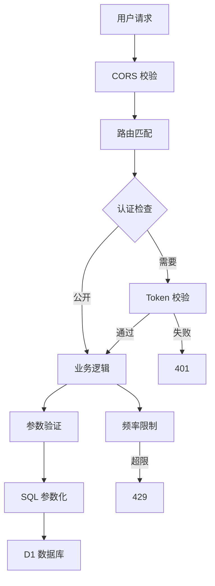

## 安全架构

## 密码安全

| 算法 | 说明 |
|------|------|
| PBKDF2-SHA256 | 密码派生函数 |
| 加盐 | 每次生成随机盐值 |
| 100,000 次迭代 | 暴力破解成本极高 |
| 零明文 | 永不存储/传输明文 |

## 会话管理

| 特性 | 说明 |
|------|------|
| Token | 32 字节随机 hex |
| 有效期 | 7 天 |
| 存储 | D1 `admin_sessions` 表 |
| 客户端 | 浏览器 `localStorage` |
| 传输 | `Authorization: Bearer <token>` |

## 登录限流

| 参数 | 值 |
|------|-----|
| 触发 | 同一 IP 连续失败 5 次 |
| 锁定 | 15 分钟 |

## 接口安全

| 机制 | 说明 |
|------|------|
| CORS | 配置 `SITE_URL` 后仅允许本站 |
| 接口边界 | 未知 `/api/*` 返回 JSON 404 |
| XSS 防护 | 用户输入自动转义 |
| SQL 注入 | 参数化查询 |
| 缓存安全 | 写操作 `no-store` |

## 文章加密

详见 [文章加密](/security/encryption)。

## 报告漏洞

<Warning>
请勿通过公开 Issue 报告安全漏洞。请通过 GitHub [@kejiland](https://github.com/kejiland) 私信联系维护者。
</Warning>
