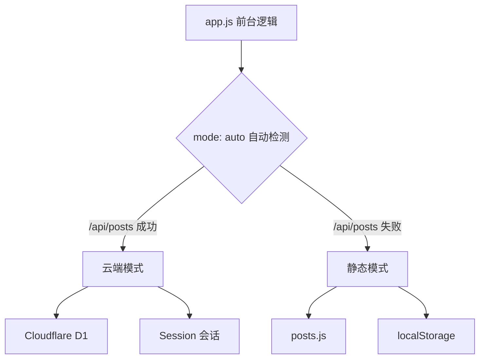

## 目录结构

```
├── public/                    # 站点本体（部署目录）
│   ├── index.html             # 页面入口
│   ├── config.js              # 全站配置
│   ├── style.css              # 前台样式
│   ├── app.js                 # 前台逻辑
│   ├── admin.js               # 后台管理 SPA
│   ├── admin.css              # 后台样式
│   ├── music-player.js        # 全站音乐播放器（右下角悬浮按钮 + 弹出面板）
│   ├── i18n.js                # 国际化模块
│   ├── posts.js               # 静态模式文章数据
│   └── locales/               # 语言包
├── functions/                 # Cloudflare API
│   ├── _lib/
│   │   ├── api-core.js        # API 核心逻辑
│   │   ├── music.js           # 音乐 API（R2 预签名直传 / 同步删除）
│   │   └── media.js           # 媒体 API（图片 R2 直传 / 元数据登记 / 同步删除）
│   ├── feed.xml.js            # 根路径 /feed.xml（云端动态 RSS）
│   ├── sitemap.xml.js         # 根路径 /sitemap.xml（云端动态 Sitemap）
│   └── api/                   # 各端点路由
├── worker.js                  # Workers 入口
├── migrations/                # D1 数据库迁移
└── .github/workflows/
    ├── deploy.yml             # 自动部署
    └── migrate-kv-to-d1.yml   # KV → D1 迁移（可选）
```

## 双通道架构

Qingyu'Blog 的核心设计是**双通道架构**——同一份代码支持两种运行模式：



## 前端架构

### 前台 (`app.js`)

- **真实路径路由**：无 hash，基于 `history.pushState`
- **Markdown 渲染**：内置解析器，支持代码高亮、TOC 生成
- **评论系统**：云端 D1 / 静态 localStorage，支持嵌套回复；重复发送拦截（后端 409 + 前端透传原因）
- **留言板**：`/guestbook` 双分区（留言 / 优化方案），复用评论管道
- **文章加密**：PBKDF2 + AES-GCM 端到端加密
- **搜索**：实时匹配标题/标签/摘要，结果展示关键字所在完整句子并高亮
- **主题切换**：深色/浅色模式
- **主题色**：6 种强调色（桌面图标按钮 + 弹层 / 手机端原生下拉）
- **多语言**：5 种语言，自动识别浏览器语言（桌面 🌐 图标弹层 / 手机原生下拉）
- **AI 文章摘要**：文章页一键生成内容摘要（单篇缓存 30 天），AI 不可用自动隐藏入口
- **全站音乐播放器**：右下角悬浮音符按钮（缩进窗口外露出一点，悬停/点击滑出）→ 弹出面板（曲目信息 / 进度 / 播放控制 / 音量 / 播放列表）；自动连播、记忆上次曲目与进度、音量持久化；无音乐隐藏、后台路由收起（独立模块 `music-player.js`，通过 `qy:route` 事件同步路由）

### 后台 (`admin.js`)

完整的 SPA 管理界面：

| 模块 | 功能 |
|------|------|
| 仪表盘 | 6 项统计卡片 + 30 天趋势图 |
| 文章管理 | 搜索/状态筛选/分页/置顶/加密；删除无感刷新（行级淡出 + 静默校准） |
| 编辑器 | Markdown 实时预览（输入框自动增高）+ 标签/封面/置顶/加密 |
| AI 写作助手 | 标题建议 / 润色 / 翻译（目标语言可选），结果可应用/复制 |
| 评论管理 | 全局列表，审核/删除，回复链追踪；删除/审核无感刷新（行级操作，不整表重载） |
| AI 评论汇总 | 一键汇总近期评论要点（1 小时缓存）+ 单条垃圾检测 |
| 标签管理 | 标签重命名/删除（批量更新相关文章） |
| 媒体库 | 图片上传（浏览器 R2 直传 + 元数据登记，仅 http/https） |
| 音乐管理 | 音频上传（R2 直传 + 进度）；文件名自动识别「歌曲名-歌手」；行内试听 / 删除（与 R2 同步）；列表卡片内滚动、表头吸顶 |
| 站点设置 | 站点信息/个人资料/导航菜单 |
| 品牌与顶栏 | 左上角 Logo 渐变方块（站点头像或首字 + 流动动画）+ 站名；右上角 🌐 语言弹层（同前台风格）；左下角个人头像（来自个人资料） |

## 后端架构

### API 核心 (`api-core.js`)

所有 API 逻辑集中在单个文件中，被两处复用：

1. **Cloudflare Pages Functions**：`functions/api/` 下的路由文件
2. **Cloudflare Workers**：`worker.js` 的路由分发

### 缓存策略

| 接口类型 | Cache-Control |
|----------|---------------|
| 只读接口 | `public, s-maxage=60, stale-while-revalidate=300` |
| RSS/Sitemap | `public, s-maxage=300, stale-while-revalidate=600` |
| 写操作 | `no-store` |

> **Feed / Sitemap 动态端点**：云端模式下 `/feed.xml`、`/sitemap.xml` 与 `/api/feed.xml`、`/api/sitemap.xml` 均实时从 D1 当前文章生成，文章增删改查后自动更新，不再需要手工维护 `public/feed.xml` / `public/sitemap.xml`。

> **管理端缓存穿透**：`GET /api/posts` 带 `s-maxage=60` 边缘缓存，删除/发布文章后管理后台会以 `api/posts?_=<时间戳>` 请求穿透缓存立即取到最新列表（配合前台 `syncDeletedPost` 内存同步，删除无需刷新网页即可全线生效）。未配置 `CF_API_TOKEN` + `CF_ZONE_ID` 时，`purgeTags` 不会主动清缓存，访客侧最长延迟 60 秒自然过期。

### 音乐（R2 直传）

音乐走**浏览器直传 R2** 通道：Worker 只签发预签名 PUT URL，音频文件不经过 Worker（规避请求体上限与带宽计费），元数据存 D1 `music` 表。删除时 Worker 侧签名向 R2 发起 DELETE 再删 D1 行。详见[音乐](/music)。

### 媒体图片（R2 直传）

后台媒体库的图片上传与音乐同款：`POST /api/media/upload-url` 签发预签名 PUT URL，浏览器**直传 R2 媒体专用桶**（`R2_MEDIA_BUCKET`，独立于音乐桶），D1 `media` 表只存元数据（url 为 R2 公开地址）。删除时若 url 是本站 `/media/` 前缀则先删 R2 对象再删 D1 行；接口仅接受 http/https 链接（不接受 base64 内嵌）。详见[媒体](/media)。
