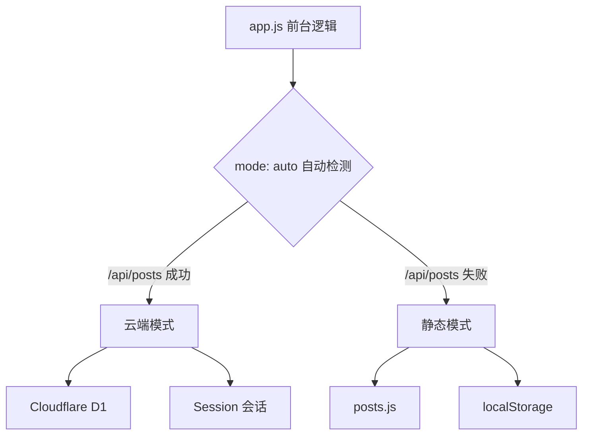

## 目录结构

```
├── public/                    # 站点本体（部署目录）
│   ├── index.html             # 页面入口
│   ├── config.js              # 全站配置
│   ├── style.css              # 前台样式
│   ├── app.js                 # 前台逻辑
│   ├── admin.js               # 后台管理 SPA
│   ├── admin.css              # 后台样式
│   ├── i18n.js                # 国际化模块
│   ├── posts.js               # 静态模式文章数据
│   └── locales/               # 语言包
├── functions/                 # Cloudflare API
│   ├── _lib/
│   │   └── api-core.js        # API 核心逻辑
│   └── api/                   # 各端点路由
├── worker.js                  # Workers 入口
├── migrations/                # D1 数据库迁移
└── .github/workflows/
    └── deploy.yml             # 自动部署
```

## 双通道架构

Qingyu'Blog 的核心设计是**双通道架构**——同一份代码支持两种运行模式：



## 前端架构

### 前台 (`app.js`)

- **真实路径路由**：无 hash，基于 `history.pushState`
- **Markdown 渲染**：内置解析器，支持代码高亮、TOC 生成
- **评论系统**：云端 D1 / 静态 localStorage，支持嵌套回复；重复发送拦截（后端 409 + 前端透传原因）
- **留言板**：`/guestbook` 双分区（留言 / 优化方案），复用评论管道
- **文章加密**：PBKDF2 + AES-GCM 端到端加密
- **搜索**：实时匹配标题/标签/摘要，结果展示关键字所在完整句子并高亮
- **主题切换**：深色/浅色模式
- **多语言**：5 种语言，自动识别浏览器语言

### 后台 (`admin.js`)

完整的 SPA 管理界面：

| 模块 | 功能 |
|------|------|
| 仪表盘 | 7 项统计卡片 + 30 天趋势图 |
| 文章管理 | 搜索/分类筛选/分页/置顶/加密；删除无感刷新（行级淡出 + 静默校准） |
| 编辑器 | Markdown 实时预览 + 元数据编辑 |
| 评论管理 | 全局列表，审核/删除，回复链追踪；删除/审核无感刷新（行级操作，不整表重载） |
| 媒体库 | 图片上传（base64 存 D1） |
| 站点设置 | 站点信息/个人资料/导航菜单 |

## 后端架构

### API 核心 (`api-core.js`)

所有 API 逻辑集中在单个文件中，被两处复用：

1. **Cloudflare Pages Functions**：`functions/api/` 下的路由文件
2. **Cloudflare Workers**：`worker.js` 的路由分发

### 缓存策略

| 接口类型 | Cache-Control |
|----------|---------------|
| 只读接口 | `public, s-maxage=60, stale-while-revalidate=300` |
| RSS/Sitemap | `public, s-maxage=300, stale-while-revalidate=600` |
| 写操作 | `no-store` |

> **管理端缓存穿透**：`GET /api/posts` 带 `s-maxage=60` 边缘缓存，删除/发布文章后管理后台会以 `api/posts?_=<时间戳>` 请求穿透缓存立即取到最新列表（配合前台 `syncDeletedPost` 内存同步，删除无需刷新网页即可全线生效）。未配置 `CF_API_TOKEN` + `CF_ZONE_ID` 时，`purgeTags` 不会主动清缓存，访客侧最长延迟 60 秒自然过期。
