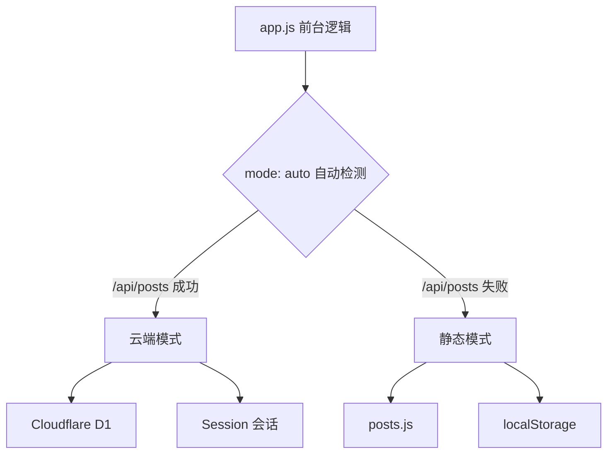
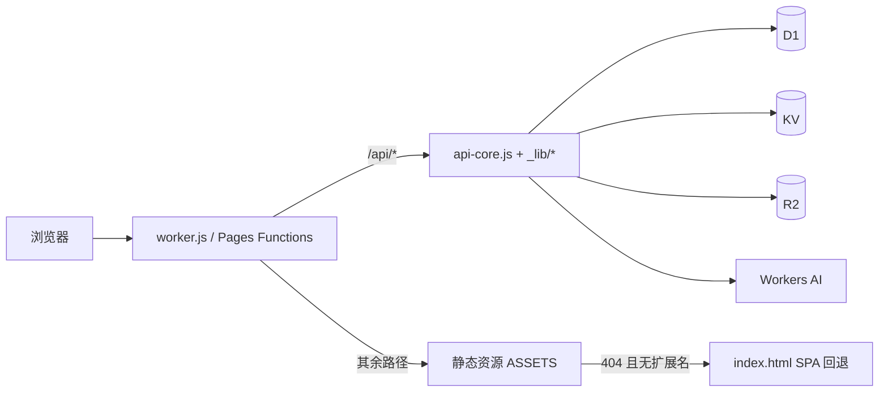

## 目录结构

```text
├── public/                          # 站点本体（部署目录，根目录直接服务其内容）
│   ├── index.html                   # 页面入口（?v=2.7.2 版本化资源 + ARD/AI Catalog 发现链接）
│   ├── config.js / config.min.js    # 全站配置
│   ├── style.css / style.min.css    # 前台样式
│   ├── app.js / app.min.js          # 前台逻辑（真实路径路由 + 渲染）
│   ├── admin.js / admin.min.js      # 后台管理 SPA（按需懒加载）
│   ├── admin.css / admin.min.css    # 后台样式（按需懒加载）
│   ├── music-player.js / .css       # 全站音乐播放器（空闲时加载，不在首屏关键路径）
│   ├── bg-anim.js / bg-anim.min.js  # 首页背景动画（空闲时加载）
│   ├── i18n.js / i18n.min.js        # 国际化模块
│   ├── posts.js / posts.min.js      # 静态模式文章数据（D1 空表兜底）
│   ├── locales/                     # 语言包 zh-CN / en / ja / ko / hi
│   ├── flags/                       # 语言国旗 SVG
│   ├── libs/smoji/                  # 内置 Smoji 表情库
│   ├── .well-known/                 # ard.json（ARD v0.91）/ ai-catalog.json（同内容，不同 content-type）
│   ├── _headers                     # Pages 响应头（安全头 + 长缓存 + .well-known 的 CORS）
│   ├── _redirects                   # Pages 路由（/public/* 301 + SPA 回退）
│   ├── robots.txt / ads.txt / llms.txt
│   └── fonts/dreamserif/            # 历史遗留 webfont 分片（当前版本不加载，可删）
├── functions/                       # Cloudflare Pages Functions
│   ├── _lib/
│   │   ├── api-core.js              # API 核心（D1 存储 / 鉴权 / 限流 / 缓存头 / 安全头）
│   │   ├── ai.js                    # Workers AI 共享库（模型调用 / KV 限流 / 摘要缓存）
│   │   ├── media.js                 # 媒体图片 R2 直传（预签名 / 删除 / 503 降级）
│   │   └── music.js                 # 音乐 R2 直传（预签名 / 删除 / 桶选择）
│   ├── api/
│   │   ├── [[path]].js              # /api/* 兜底：未知路径返回 JSON 404，绝不回退 HTML
│   │   ├── posts.js / comments.js / media.js / settings.js
│   │   ├── feed.xml.js / sitemap.xml.js
│   │   ├── posts/ comments/ media/ stats/ site-files/ admin/ ai/
│   ├── feed.xml.js                  # 根路径 /feed.xml（云端动态 RSS）
│   └── sitemap.xml.js               # 根路径 /sitemap.xml（云端动态 Sitemap）
├── worker.js                        # Cloudflare Workers 入口
├── migrations/                      # D1 迁移 0001 ~ 0015
├── scripts/
│   ├── migrate-kv-to-d1.mjs         # KV → D1 迁移（可选）
│   ├── minify.mjs                   # 生成 public/*.min.js / *.min.css
│   └── screenshots/                 # 可复现截图工具（demo-content / demo-server / capture）
├── smoke-test.js / gb-verify.js / search-verify.js   # 三套零依赖测试
├── seed.js                          # 导入示例文章到云端实例
├── wrangler.workers.toml            # Workers 部署配置（main + [assets] + KV/D1/AI 绑定）
├── wrangler.toml                    # Pages 配置（pages_build_output_dir = public）
└── .github/workflows/
    ├── deploy.yml                   # 自动部署（测试 → 迁移 → 部署 → 写入 Secret）
    └── migrate-kv-to-d1.yml         # KV → D1 迁移（可选）
```

## 双通道架构

Qingyu'Blog 的核心设计是**双通道架构**——同一份代码支持两种运行模式：



云端模式下，请求分两条路径落地：



## 前端架构

### 前台 (`app.js`)

- **真实路径路由**：无 hash，基于 `history.pushState`；`file://` 本地打开自动退化为 `#/` 内部路由
- **Markdown 渲染**：内置解析器，支持代码高亮、TOC 生成
- **评论系统**：云端 D1 / 静态 localStorage，支持嵌套回复；重复发送拦截（后端 409 + 前端透传原因）
- **留言板**：`/guestbook` 双分区（留言 / 优化方案），复用评论管道
- **文章加密**：PBKDF2 + AES-GCM 端到端加密
- **搜索**：实时匹配标题/标签/摘要，结果展示关键字所在完整句子并高亮
- **主题与强调色**：深色/浅色两档（`qingyu.theme`）× **4 种强调色** `terra`（赭橙，默认）/ `indigo`（黛蓝）/ `bamboo`（竹青）/ `dusk`（凝夜紫），存 `qingyu.accent`；桌面为图标按钮 + 色板弹层，手机端为原生下拉
- **背景动画**：首页春夏秋冬素描粒子动画，桌面默认开启、触屏默认关闭，开关存 `qingyu.bgAnim`；脚本按需加载
- **多语言**：5 种语言，自动识别浏览器语言（桌面 🌐 图标弹层 / 手机原生下拉），选择存 `blog.locale`
- **AI 文章摘要**：文章页一键生成内容摘要（单篇缓存 30 天），AI 不可用自动隐藏入口
- **全站音乐播放器**：右下角悬浮音符按钮（缩进窗口外露出一点，悬停/点击滑出）→ 弹出面板（曲目信息 / 进度 / 播放控制 / 音量 / 播放列表）；自动连播、记忆上次曲目与进度、音量持久化；无音乐隐藏、后台路由收起（独立模块 `music-player.js`，通过 `qy:route` 事件同步路由）

### 资源按需加载

首屏只加载 `config.min.js`、`posts.min.js`、`i18n.min.js`、`app.min.js` 与 `style.min.css`，其余重资源全部延后：

| 资源 | 加载时机 |
|------|----------|
| `admin.min.css` + `admin.min.js` | 进入 `/admin`、`/write`、`/posts/:id/edit`，或弹出改密弹窗时（`ensureAdminBundle()`） |
| `bg-anim.min.js` | 空闲回调（`requestIdleCallback`，超时 2500ms；无该 API 时回退 1600ms 定时器）；触屏设备不预载 |
| `music-player.min.css` + `music-player.min.js` | 空闲回调（同上）；后台路由不预载，且进入后台时自动收起播放器 |
| `libs/smoji/*` | 首次点击表情按钮时再加载样式与数据 |

### 后台 (`admin.js`)

完整的 SPA 管理界面（懒加载 `admin.min.js` / `admin.min.css`）：

| 模块 | 功能 |
|------|------|
| 仪表盘 | 6 项统计卡片 + 30 天趋势图 |
| 文章管理 | 搜索/状态筛选/分页/置顶；删除无感刷新（行级淡出 + 静默校准） |
| 编辑器 | Markdown 实时预览（输入框自动增高）+ 标签/封面/置顶 |
| AI 写作助手 | 标题建议 / 润色 / 翻译（目标语言可选），结果可应用/复制 |
| 评论管理 | 全局列表，审核/删除，回复链追踪；删除/审核无感刷新（行级操作，不整表重载） |
| AI 评论汇总 | 一键汇总近期评论要点（1 小时缓存）+ 单条垃圾检测 |
| 标签管理 | 标签重命名/删除（批量更新相关文章） |
| 媒体库 | 图片上传（浏览器 R2 直传 + 元数据登记，仅 http/https） |
| 音乐管理 | 音频上传（R2 直传 + 进度）；文件名自动识别「歌曲名-歌手」；行内试听 / 删除（与 R2 同步）；列表卡片内滚动、表头吸顶 |
| 站点设置 | 站点信息 / 个人资料 / 导航菜单 / 底部导航 / 友情链接 / 评论审核开关 |
| 品牌与顶栏 | 左上角 Logo 渐变方块（站点头像或首字 + 流动动画）+ 站名；右上角 🌐 语言弹层（同前台风格）；左下角个人头像（来自个人资料） |

<Note>
后台编辑器**没有**分类与发布状态 UI，也**没有**加密 UI：`posts.category` 列保留兼容（分类功能已于 v2.2 移除），`protected` / `enc` 字段保留供外部导入的加密文章使用。
</Note>

## 后端架构

### API 核心 (`api-core.js`)

所有 API 逻辑集中在单个文件中，被两处复用：

1. **Cloudflare Pages Functions**：`functions/api/` 下的路由文件
2. **Cloudflare Workers**：`worker.js` 的路由分发

### Workers 入口 (`worker.js`)

`worker.js` 负责三件事：

1. **API 路由分发**：把 `/api/*` 请求交给 `api-core.js` 或 `_lib/` 中的处理函数
2. **静态资源服务与 SPA 回退**：静态文件命中 404、请求方法为 `GET`/`HEAD` 且路径**不含扩展名**时，回退为 `index.html`（由前端按 `pathname` 渲染）；带扩展名的真实文件不会回退
3. **未知 `/api/*` 一律 JSON 404**：`/api` 与 `/api/` 开头且未命中任何路由的请求返回 `{"ok":false,"error":"Not Found"}`，**绝不回退 HTML**，避免调用方拿到 HTML 再去 `JSON.parse` 时报出难懂的解析错误

### Pages 侧兜底 (`functions/api/[[path]].js`)

Pages 部署下 `public/_redirects` 末尾的 SPA 回退规则 `/* /index.html 200` 会把「没有对应函数文件」的 `/api/*` 路径兜成 HTML 200（例如 `/api/music/upload-url`，音乐上传只在 `worker.js` 实现）。catch-all 动态路由 `[[path]].js` 因此承担 Pages 侧兜底：

- 已知的具体路由（`KNOWN_ROUTES`，与 `functions/api/**` 一一对应）显式放行，不吞真实接口
- 其余未知 `/api/*` 返回 JSON 404（带 `hint` 说明）
- `OPTIONS` 预检直接回 CORS 头，避免浏览器把「无 ACAO 的 404」报成 CORS 错误

### 缓存策略

| 接口类型 | Cache-Control |
|----------|---------------|
| 只读接口 | `public, s-maxage=60, stale-while-revalidate=300` |
| RSS/Sitemap | `public, s-maxage=300, stale-while-revalidate=600` |
| 写操作 / 鉴权接口 | `no-store` |

> **Feed / Sitemap 动态端点**：云端模式下 `/feed.xml`、`/sitemap.xml` 与 `/api/feed.xml`、`/api/sitemap.xml` 均实时从 D1 当前文章生成，文章增删改查后自动更新，不再需要手工维护 `public/feed.xml` / `public/sitemap.xml`。D1 空表且**尚未配置过管理员**时，`readPosts()` 会回退到静态 `posts.js` 示例文章；一旦写过 `admin_auth`（视为作者已接管），空表就返回空，避免删光文章后示例内容「复活」。

> **按标签清缓存**：只读响应带 `Cache-Tag`（`posts` / `feed` / `sitemap` / `post:<id>` / `stats:<id>`）。写操作后由 `purgeTags()` 调用 Cloudflare Cache Purge API 按标签清除，让「发布即生效」。需要 `CF_ZONE_ID` + 具备 Zone·Cache Purge 权限的 Token（工作流会把它写成 Worker 的 `CF_API_TOKEN`）；未配置时不清缓存，依赖 `s-maxage` 自然过期，访客侧最长延迟 60 秒。

> **管理端缓存穿透**：`GET /api/posts` 带 `s-maxage=60` 边缘缓存，删除/发布文章后管理后台会以 `api/posts?_=<时间戳>` 请求穿透缓存立即取到最新列表（配合前台内存同步，删除无需刷新网页即可全线生效）。

### KV 的真实用途

KV（绑定名 `BLOG`）**只用于限流计数、去重标记与 AI 缓存**，不再存文章、feed 或 sitemap 缓存：

| 键 | 用途与窗口 |
|----|------------|
| `rate:cmt:<ip>:<窗口>` | 评论频控（5 条/分钟） |
| `rate:like:<ip>:<窗口>` | 点赞频控（10 次/分钟） |
| `rate:view:<ip>:<窗口>` | 浏览频控（30 次/分钟） |
| `liked:<ip>:<postId>` | 点赞去重（30 天） |
| `viewed:<ip>:<postId>` | 浏览去重（1 小时） |
| `ai:sum:*` / `ai:assist:day:*` / `ai:cmt:day:*` | AI 摘要缓存与每日额度 |
| `ai:sum:<slug>:<lang>` / `ai:cmt:sum` | 单篇摘要缓存 / 评论汇总缓存 |

<Warning>
KV 未绑定时频控会**静默失效**（服务端打印告警）；AI 的全站每日额度计数采用 fail-closed，KV 不可用时直接拒绝生成。
</Warning>

### 音乐（R2 直传）

音乐走**浏览器直传 R2** 通道：Worker 只签发预签名 PUT URL，音频文件不经过 Worker（规避请求体上限与带宽计费），元数据存 D1 `music` 表。删除时 Worker 侧签名向 R2 发起 DELETE 再删 D1 行。

目标桶由 `musicStorage()` 决定：`R2_BUCKET` 与 `R2_PUBLIC_BASE` **都非空**时写音乐桶，否则回退到 `R2_MEDIA_BUCKET` + `R2_MEDIA_PUBLIC_BASE`。详见[音乐](/music)。

### 媒体图片（R2 直传）

后台媒体库的图片上传与音乐同款：`POST /api/media/upload-url` 签发预签名 PUT URL，浏览器**直传 R2 媒体专用桶**（`R2_MEDIA_BUCKET`），D1 `media` 表只存元数据（url 为 R2 公开地址）。删除时若 url 属于本站媒体公开域名则先删 R2 对象再删 D1 行；接口仅接受 http/https 链接（不接受 base64 内嵌）。详见[媒体](/media)。

## 静态资源缓存与安全响应头

`worker.js` 会给**所有**静态响应统一注入安全响应头，并按路径类型设置缓存：

| 条件 | Cache-Control |
|------|---------------|
| 带 `?v=`（版本化资源）或位于 `/fonts/`、`/flags/`、`/libs/smoji/` | `public, max-age=31536000, immutable` |
| 其他带扩展名的静态文件 | `public, max-age=3600, stale-while-revalidate=86400` |
| 无扩展名的 HTML 入口 | `no-cache`（每次重新验证，ETag 命中即 304） |

安全响应头清单（`securityHeaders()`，API 响应与静态响应共用）：`X-Content-Type-Options: nosniff`、`Referrer-Policy: strict-origin-when-cross-origin`、`X-Frame-Options: SAMEORIGIN`、`Cross-Origin-Opener-Policy: same-origin`、`Content-Security-Policy`（含 `object-src 'none'`、`frame-ancestors 'none'`、`form-action 'self'`）。

<Info>
Pages 纯静态路径下 HTML 由 Pages 直接返回、不经过任何函数，因此同样的安全头在 `public/_headers` 中重复声明了一份（见[部署到 Cloudflare Workers](/cloudflare-workers)）。缓存与安全的完整说明见[安全概览](/security-overview)。
</Info>

## 资源发现

站点为主流 AI/Agent 抓取提供了三个发现入口：

| 文件 | 说明 |
|------|------|
| `public/.well-known/ard.json` | Agentic Resource Discovery（ARD v0.91）清单 |
| `public/.well-known/ai-catalog.json` | 与 ARD 内容相同，但 `Content-Type` 为 `application/ai-catalog+json`（旧版兼容入口） |
| `public/llms.txt` | 中英对照的站点摘要（关键页面 / 功能 / 技术栈 / 链接） |

`public/index.html` 中通过 `<link rel="ard">` 与 `<link rel="ai-catalog">` 声明；`public/_headers` 为这两个 JSON 设置了 `Access-Control-Allow-Origin: *` 与 1 小时缓存。
