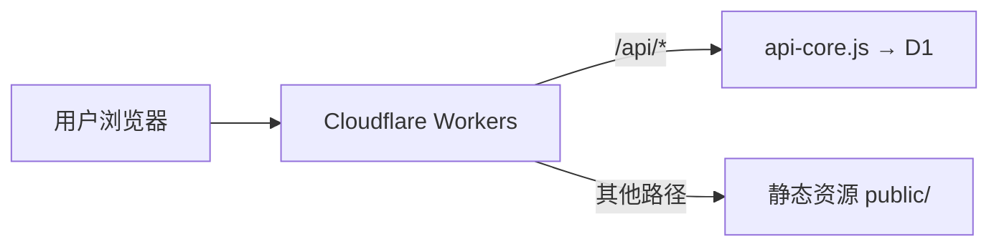

## 架构概览



## 前提条件

- 注册 [Cloudflare](https://dash.cloudflare.com/sign-up) 账号
- 安装 Wrangler CLI：`npm install -g wrangler`

## 步骤一：创建资源

### 登录

```bash
npx wrangler login
```

### 创建 D1 数据库

```bash
npx wrangler d1 create blog
```

记下输出的 `database_id`（UUID 格式）。

### 创建 KV 命名空间

```bash
npx wrangler kv namespace create BLOG
```

记下输出的 `id`（32 位十六进制）。

## 步骤二：配置 GitHub Secrets

在仓库 **Settings → Secrets and variables → Actions** 中添加：

| Secret | 必填 | 说明 |
|--------|------|------|
| `CLOUDFLARE_API_TOKEN` | ✅ | API Token（需 Workers + D1 + KV 权限） |
| `CLOUDFLARE_ACCOUNT_ID` | ✅ | 账户 ID（Dashboard 右侧可见） |
| `BLOG_D1_ID` | ✅ | D1 数据库 ID（UUID） |
| `BLOG_KV_ID` | ✅ | KV 命名空间 ID |
| `BLOG_ADMIN_SETUP_KEY` | 推荐 | 首次设置密码的密钥 |
| `SITE_URL` | 推荐 | 站点域名（用于 CORS / RSS） |
| `CF_ZONE_ID` | 可选 | Zone ID（发布即清缓存） |

<Warning>
请先阅读 [GitHub Secrets 配置](/deploy/github-secrets) 获取每个 Secret 的详细获取步骤。
</Warning>

## 步骤三：部署

推送到 `main` 分支，GitHub Actions 自动：

1. ✅ 校验 Secrets
2. ✅ 执行 D1 迁移
3. ✅ 部署 Worker
4. ✅ 写入运行时 Secret

## 步骤四：首次设置密码

访问 `https://<worker名>.<子域>.workers.dev/admin`：

- 配置了 `BLOG_ADMIN_SETUP_KEY`：用该密钥设置密码
- 否则：自动生成随机密码，登录后强制修改

## Wrangler 配置

### Workers (`wrangler.workers.toml`)

```toml
name = "kejiland"
main = "worker.js"
compatibility_date = "2025-02-01"

[assets]
directory = "./public"
binding = "ASSETS"
not_found_handling = "single-page-application"
html_handling = "auto-trailing-slash"

[[kv_namespaces]]
binding = "BLOG"
id = "{env.BLOG_KV_ID}"

[[d1_databases]]
binding = "DB"
database_name = "blog"
database_id = "{env.BLOG_D1_ID}"
```

### Pages (`wrangler.toml`)

```toml
name = "azhz"
compatibility_date = "2025-02-01"
pages_build_output_dir = "public"

[[kv_namespaces]]
binding = "BLOG"
id = "{env.BLOG_KV_ID}"

[[d1_databases]]
binding = "DB"
database_name = "blog"
database_id = "{env.BLOG_D1_ID}"
```
