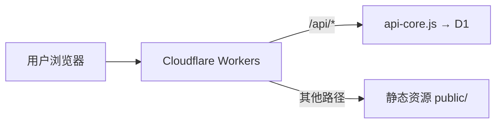

## 架构概览



## 前提条件

- 注册 [Cloudflare](https://dash.cloudflare.com/sign-up) 账号
- 安装 Wrangler CLI：`npm install -g wrangler`

## 步骤一：创建资源

### 登录

```bash
npx wrangler login
```

### 创建 D1 数据库

```bash
npx wrangler d1 create blog
```

记下输出的 `database_id`（UUID 格式）。

### 创建 KV 命名空间

```bash
npx wrangler kv namespace create BLOG
```

记下输出的 `id`（32 位十六进制）。

## 步骤二：配置 GitHub Secrets

在仓库 **Settings → Secrets and variables → Actions** 中添加：

| Secret | 必填 | 说明 |
|--------|------|------|
| `CLOUDFLARE_API_TOKEN` | ✅ | API Token（需 Workers + D1 + KV 权限） |
| `CLOUDFLARE_ACCOUNT_ID` | ✅ | 账户 ID（Dashboard 右侧可见） |
| `BLOG_D1_ID` | ✅ | D1 数据库 ID（UUID） |
| `BLOG_KV_ID` | ✅ | KV 命名空间 ID |
| `BLOG_ADMIN_SETUP_KEY` | 推荐 | 首次设置密码的密钥 |
| `SITE_URL` | 推荐 | 站点域名（用于 CORS / RSS / Sitemap） |
| `CF_ZONE_ID` | 可选 | Zone ID（发布即清缓存） |

<Warning>
请先阅读 [GitHub Secrets 配置](/deploy/github-secrets) 获取每个 Secret 的详细获取步骤。
</Warning>

## 步骤三：部署

推送到 `main` 分支，GitHub Actions 自动：

1. ✅ 安装依赖与 Wrangler CLI
2. ✅ 运行测试（`smoke-test.js` / `gb-verify.js` / `search-verify.js`，失败即中止不部署）
3. ✅ 校验 Secrets（必填：`CLOUDFLARE_API_TOKEN` / `CLOUDFLARE_ACCOUNT_ID` / `BLOG_D1_ID` / `BLOG_KV_ID`）
4. ✅ 执行 D1 迁移（`schema_migrations` 记账表三层幂等策略，见[迁移脚本](/migrations)）
5. ✅ 部署 Worker
6. ✅ 写入运行时 Secret（若配置了 `BLOG_ADMIN_SETUP_KEY` 才写入；未配置则跳过）

## 步骤四：首次设置密码

访问 `https://www.2024921.xyz/admin`：

- 配置了 `BLOG_ADMIN_SETUP_KEY`：用该密钥设置密码
- 否则：自动生成随机密码，登录后强制修改

## Wrangler 配置

### Workers (`wrangler.workers.toml`)

```toml
name = "kejiland"
main = "worker.js"
compatibility_date = "2025-02-01"

[assets]
directory = "./public"
binding = "ASSETS"
not_found_handling = "single-page-application"
html_handling = "auto-trailing-slash"

[[kv_namespaces]]
binding = "BLOG"
id = "{env.BLOG_KV_ID}"

[[d1_databases]]
binding = "DB"
database_name = "blog"
database_id = "{env.BLOG_D1_ID}"

[ai]                          # Workers AI（binding 名必须为 AI，用于摘要 / 写作助手 / 评论汇总）
binding = "AI"
```

### Workers AI（推理）

AI 功能由 Cloudflare Workers AI 提供（默认模型 `@cf/meta/llama-3.2-3b-instruct`），按 Neurons 计费，**每天 10,000 Neurons 免费额度**（约数千次摘要级调用）：

- 绑定点：`wrangler.workers.toml` 中的 `[ai] binding = "AI"`（部署时自动创建；不要在控制台手动重复绑定）
- 关闭开关：环境变量 `BLOG_AI_ENABLED` 设为 `0` / `false` / `off` 可整体禁用
- **优雅降级**：未绑定 AI、未配置 D1 或开关关闭时，`/api/ai/*` 返回 404，前端 `aiProbe` 自动隐藏所有 AI 入口，博客其余功能零影响
- 前端记忆：探测「可用」缓存 10 分钟、「不可用」仅 30 秒，AI 上线/修复后刷新页面即恢复

### R2（音乐音频 + 媒体图片存储）

音乐音频与媒体图片本体都存放在 **R2** 对象存储，元数据分别在 D1（`music` / `media` 表）。通过 **S3 兼容 API** 接入（非 Wrangler R2 绑定）：

**音乐**（音频）：

- **上传**：Worker 签发 SigV4 预签名 PUT URL，浏览器**直传 R2**（文件不经过 Worker）；格式白名单 mp3 / m4a / ogg / wav / aac / opus / flac，单文件 ≤ 30MB
- **读取**：R2 桶绑定自定义域名（如 `music.example.com` → `public.r2.dev`），前台播放器直接拉流
- **删除**：Worker 侧签名 DELETE（`host;x-amz-content-sha256;x-amz-date`）成功后再删 D1 行，两者保持一致
- 环境变量（GitHub Secrets）：`R2_ACCESS_KEY_ID` / `R2_SECRET_ACCESS_KEY` / `R2_ENDPOINT` / `R2_BUCKET` / `R2_PUBLIC_BASE`

**媒体图片**（独立桶）：

- **上传**：同款预签名直传模式，走**媒体专用桶**；格式白名单 png / jpg / jpeg / webp / gif / svg / avif / bmp / ico，单文件 ≤ 10MB
- **删除**：url 为本站 `/media/` 前缀时先删 R2 对象再删 D1 元数据
- 环境变量：`R2_ACCESS_KEY_ID` / `R2_SECRET_ACCESS_KEY` / `R2_ENDPOINT` / `R2_MEDIA_BUCKET` / `R2_MEDIA_PUBLIC_BASE`

**降级**：未配置 R2 凭据时读取列表仍可用（D1），上传返回 `503`。

> ⚠️ **自定义域优先级**：同主机名下，Worker 自定义域绑定会**覆盖** R2 自定义域。若 `music.example.com` 曾被绑定到某 Worker，需先在 Workers 控制台删除该绑定，R2 自定义域才能接管流量。

### Pages (`wrangler.toml`)

```toml
name = "azhz"
compatibility_date = "2025-02-01"
pages_build_output_dir = "public"

[[kv_namespaces]]
binding = "BLOG"
id = "{env.BLOG_KV_ID}"

[[d1_databases]]
binding = "DB"
database_name = "blog"
database_id = "{env.BLOG_D1_ID}"
```
