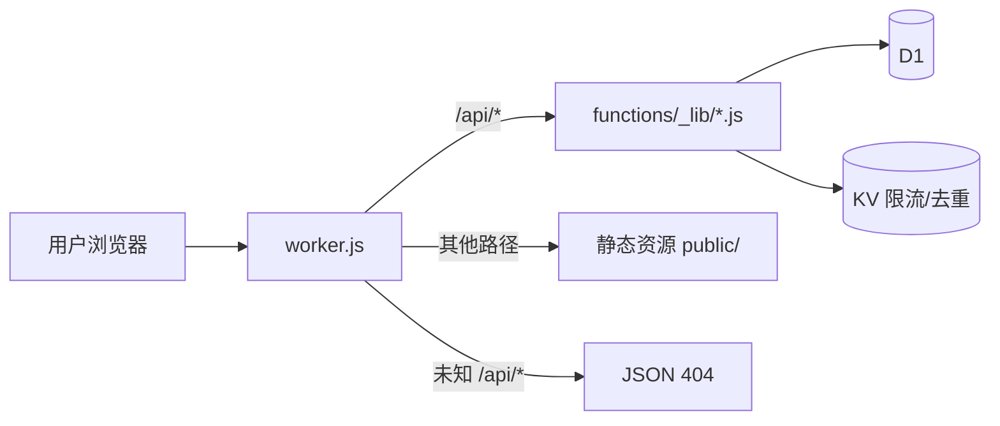

## 架构概览



- **入口**：`worker.js` 负责路由分发、SPA 回退、静态资源缓存头与安全响应头
- **API 实现**：`functions/_lib/api-core.js`（文章 / 评论 / 统计 / 认证 / 设置 / RSS / Sitemap）、`functions/_lib/{media,music}.js`（R2 直传）与 `functions/api/ai/*.js`（Workers AI）
- **Pages 兜底**：`functions/api/[[path]].js` 让 Pages 侧未知 `/api/*` 也返回 JSON 404，绝不回退 HTML
- **兼容性日期**：`2025-02-01`

## 前提条件

- 注册 [Cloudflare](https://dash.cloudflare.com/sign-up) 账号
- 安装 Wrangler CLI：`npm install -g wrangler`

## 步骤一：创建资源

### 登录

```bash
npx wrangler login
```

### 创建 D1 数据库

```bash
npx wrangler d1 create blog
```

记下输出的 `database_id`（**UUID 格式，带横线**）。注意它不是数据库名，也不是 KV 的 id。

### 创建 KV 命名空间

```bash
npx wrangler kv namespace create BLOG
```

记下输出的 `id`（**32 位十六进制**）。

<Info>
KV 不是文章存储，而是限流与去重设施（评论 5 条/分钟、点赞 10 次/分钟、浏览 30 次/分钟、点赞 30 天去重、浏览 1 小时去重、AI 用量与缓存）。未绑定时这些限制会静默失效（日志里有 warning）。
</Info>

## 步骤二：配置 GitHub Secrets

在仓库 **Settings → Secrets and variables → Actions → Secrets** 中添加（**不要**加到 Variables，工作流只读 Secrets）：

| Secret | 必填 | 说明 |
|--------|------|------|
| `CLOUDFLARE_API_TOKEN` | ✅ | Account API Token（需 Workers Scripts / D1 / KV 的 Edit 权限） |
| `CLOUDFLARE_ACCOUNT_ID` | ✅ | 账户 ID（32 位十六进制） |
| `BLOG_D1_ID` | ✅ | D1 数据库 ID（UUID） |
| `BLOG_KV_ID` | ✅ | KV 命名空间 ID（32 位十六进制） |
| `BLOG_ADMIN_SETUP_KEY` | 推荐 | 安装密钥：初始化管理员与登录应急通道（防抢注，强烈建议） |
| `SITE_URL` | 推荐 | 站点域名（如 `https://blog.example.com`，末尾不加 `/`）。用于收紧 CORS / RSS / Sitemap |
| `CF_ZONE_ID` | 可选 | Zone ID，配合 Cache Purge 权限实现「发布即清缓存」 |
| `PAGES_PROJECT_NAME` | 可选 | **名字有误导性**：实际作用是覆盖 Worker 名称（`--name`）。不填则用 `wrangler.workers.toml` 里的 `kejiland` |
| `BLOG_WRITE_TOKEN` | 可选 | 旧式静态写入令牌，新部署不需要 |
| `BLOG_RATE_LIMIT_BINDING` | 可选 | 正整数（如 `1001`）：启用 Worker 内边缘登录限流，见下方「可选：边缘限流绑定」 |
| `R2_ACCESS_KEY_ID` | 可选 | R2 S3 凭据（音乐与媒体**共用**这一对） |
| `R2_SECRET_ACCESS_KEY` | 可选 | R2 S3 凭据 |
| `R2_ENDPOINT` | 可选 | 形如 `https://<accountid>.r2.cloudflarestorage.com`，不带桶名、末尾不加 `/` |
| `R2_BUCKET` | 可选 | **音乐桶**名（不能为空，否则整组 R2 配置不写入） |
| `R2_PUBLIC_BASE` | 可选 | 音乐桶公开域名，如 `https://music.example.com` |
| `R2_MEDIA_BUCKET` | 可选 | **媒体桶**名，如 `qingyu-media` |
| `R2_MEDIA_PUBLIC_BASE` | 可选 | 媒体桶公开域名，如 `https://media.example.com` |

逐项的获取位置与格式说明见 [GitHub Secrets 配置](/github-secrets)，完整的新手教程见 [CLOUDFLARE_SETUP_GUIDE.md](https://github.com/kejiland/qingyu-blog/blob/main/CLOUDFLARE_SETUP_GUIDE.md)。

## 步骤三：部署

推送到 `main` 分支（或手动 Run workflow），GitHub Actions 依次执行：

1. ✅ Checkout + 安装 Node 24
2. ✅ **安装 Wrangler**：默认 `wrangler@3.90.0`；若配置了 `BLOG_RATE_LIMIT_BINDING`，改为 `wrangler@^4.36.0`（该绑定要求 4.36+）
3. ✅ 运行三套测试（`smoke-test.js` 78 例 / `gb-verify.js` 18 例 / `search-verify.js` 13 例，失败即中止不部署）
4. ✅ 校验必要 Secrets 齐全（`BLOG_KV_ID` / `BLOG_D1_ID` / `CLOUDFLARE_API_TOKEN` / `CLOUDFLARE_ACCOUNT_ID`）
5. ✅ 生成 `wrangler.workers.ci.toml`：先校验 ID 格式（`BLOG_KV_ID` 必须是 32 位十六进制、`BLOG_D1_ID` 必须是 UUID），再用脚本显式替换 `{env.BLOG_KV_ID}` 与 `{env.BLOG_D1_ID}`；`{env.SITE_URL}` / `{env.CF_ZONE_ID}` 缺失时替换为空串（安全降级，不留字面量占位符）
6. ✅ 执行 D1 迁移（`migrations/*.sql` 按文件名升序，`schema_migrations` 记账表 + 列预检 + 报错兜底三层幂等，见[迁移脚本](/migrations)）
7. ✅ 部署 Worker（`wrangler deploy --config wrangler.workers.ci.toml`）
8. ✅ 写入运行时 Secret：`BLOG_ADMIN_SETUP_KEY`（配置了才写）、`BLOG_WRITE_TOKEN`（配置了才写）、`CF_API_TOKEN`（**自动写入**，值取 `CLOUDFLARE_API_TOKEN`，用于调 Cache Purge 接口）、R2 相关变量（凭据 / Endpoint / 桶名齐备才写）

<Note>
手动触发时工作流会额外跑一步 `wrangler whoami`，便于定位凭证问题。改完任何 Secret 都必须**重新运行一次部署**，GitHub Secret 的修改不会自动同步到已部署的 Worker。
</Note>

## 步骤四：首次设置密码

访问 `https://你的域名/admin`：

- **配置了 `BLOG_ADMIN_SETUP_KEY`**（推荐）：页面点「首次部署？使用安装密钥初始化」，填新密码（**至少 8 位**）+ 安装密钥。在初始化之前，登录接口一律返回 403，别人抢不走管理员账号
- **未配置**：首次登录会自动生成随机默认密码（格式 `xxxx-xxxx`，标记 `must_change`）并直接签发会话，登录后请立刻改密。存在先到先得竞态，全新部署建议配置安装密钥

## Wrangler 配置

### Workers (`wrangler.workers.toml`)

```toml
name = "kejiland"
main = "worker.js"
compatibility_date = "2025-02-01"

[assets]
directory = "./public"
binding = "ASSETS"
not_found_handling = "single-page-application"
html_handling = "auto-trailing-slash"

[[kv_namespaces]]
binding = "BLOG"
id = "{env.BLOG_KV_ID}"
preview_id = "{env.BLOG_KV_ID}"

[[d1_databases]]
binding = "DB"
database_name = "blog"
database_id = "{env.BLOG_D1_ID}"

[ai]                          # Workers AI（binding 名必须为 AI，用于摘要 / 写作助手 / 评论汇总）
binding = "AI"

[vars]                        # 非敏感变量，部署时由 Actions 替换占位符；缺失则为空
SITE_URL = "{env.SITE_URL}"
CF_ZONE_ID = "{env.CF_ZONE_ID}"
```

<Warning>
wrangler 对 KV 的 `id` **不支持 `{env.}` 内插**，所以 CI 用脚本显式替换占位符。本地调试时也要先手动把 `{env.BLOG_KV_ID}` / `{env.BLOG_D1_ID}` 换成真实值，否则配置无法解析。
</Warning>

### 可选：边缘限流绑定

`wrangler.workers.toml` 里**没有**启用 `[[ratelimits]]`（默认关闭）。该绑定需要 wrangler ≥ 4.36，且并非所有账户都能部署，所以采用「按需注入」：

```toml
[[ratelimits]]
name = "LOGIN_LIMITER"
namespace_id = "1001"
  [ratelimits.simple]
  limit = 10      # 每个 Cloudflare 数据中心、每个 key、每个周期允许的次数
  period = 60     # 只能是 10 或 60（秒）
```

| 项目 | 说明 |
|------|------|
| 怎么开 | GitHub Secrets 加 `BLOG_RATE_LIMIT_BINDING`（正整数，如 `1001`）后重新部署 |
| 自动发生什么 | 工作流改用 wrangler 4.x，并把上面这段注入 `wrangler.workers.ci.toml`，绑定名固定 `LOGIN_LIMITER` |
| 不配会怎样 | 行为与旧版**完全一致**：代码检测不到 `env.LOGIN_LIMITER` 就回退到 D1 计数 |
| 部署报错 | 说明账户 / 套餐不支持该绑定，删掉这个 Secret 重新部署即可恢复 |

计数器按 Cloudflare 数据中心本地缓存、最终一致，定位是「防滥用」而非精确计费。被拦下的请求不查库也不写库。

### 静态资源缓存策略

Worker 对静态响应统一设置 `Cache-Control`：

| 资源 | Cache-Control |
|------|---------------|
| 带 `?v=` 版本号，或位于 `/fonts/`、`/flags/`、`/libs/smoji/` | `public, max-age=31536000, immutable` |
| 其他带扩展名的静态文件 | `public, max-age=3600, stale-while-revalidate=86400` |
| 无扩展名的 HTML 入口 | `no-cache`（靠 ETag 命中 304） |

API 侧另有自己的策略：只读接口 `public, s-maxage=60, stale-while-revalidate=300`（RSS / Sitemap 为 `s-maxage=300`），写接口与评论列表一律 `no-store`。

<Info>
**发布即生效的闭环**：只读接口带 `Cache-Tag`（`posts` / `feed` / `sitemap` / `post:<id>` / `stats:<id>`），文章增删改后 Worker 会调 Cloudflare Cache Purge API 按标签清除。需要同时配置 `CF_ZONE_ID`（`[vars]`）与 `CF_API_TOKEN`（工作流自动写入，取 `CLOUDFLARE_API_TOKEN` 的值，Token 需含 Zone·Cache Purge 权限）。
</Info>

### Pages (`wrangler.toml`)

```toml
name = "azhz"
compatibility_date = "2025-02-01"
pages_build_output_dir = "public"

[[kv_namespaces]]
binding = "BLOG"
id = "{env.BLOG_KV_ID}"

[[d1_databases]]
binding = "DB"
database_name = "blog"
database_id = "{env.BLOG_D1_ID}"
```

<Note>
`[ai]` / `[assets]` / `main` 都是 Workers 专属配置，Pages 配置里没有；`functions/api/[[path]].js` 则是 **Pages 侧**的兜底，让未知 `/api/*` 也返回 JSON 404（`public/_redirects` 的 SPA 回退本来会把它们兜成 HTML 200）。
</Note>

<Warning>
**`/api/music*` 只在 Workers 可用**：它只在 `worker.js` 里实现，`functions/` 下没有对应文件。所以 Pages 部署下音乐功能不可用（接口返回 JSON 404）。
</Warning>

## Workers AI（推理）

AI 功能由 Cloudflare Workers AI 提供（默认模型 `@cf/meta/llama-3.2-3b-instruct`），按 Neurons 计费，**每天约 10,000 Neurons 免费额度**（约数千次摘要级调用）：

| 接口 | 用途 | 限制 |
|------|------|------|
| `GET /api/ai/ping` | 可用性探测（前端据此显示 / 隐藏全部 AI 入口） | — |
| `GET/POST /api/ai/summary` | 文章摘要（单篇缓存 30 天，`force` 重新生成需登录） | IP 8 次/时；全站 300 次/天 |
| `POST /api/ai/assist` | 写作助手：标题建议 / 润色 / 翻译 | 200 次/天 |
| `POST /api/ai/comments` | 评论汇总（缓存 1 小时）与单条垃圾检测 | 100 次/天 |

- 绑定点：`wrangler.workers.toml` 中的 `[ai] binding = "AI"`（部署时自动创建；不要在控制台手动重复绑定）
- 关闭开关：环境变量 `BLOG_AI_ENABLED` 设为 `0` / `false` / `off` 可整体禁用；`BLOG_AI_PUBLIC` 设为同样值可**禁止匿名访客生成摘要**（登录后仍可用），防止被任意脚本刷走免费额度
- 这两个变量**不由工作流写入**，需要你在 Worker 上手动设置：`npx wrangler secret put BLOG_AI_ENABLED --name kejiland`（`BLOG_AI_PUBLIC` 同理）
- **优雅降级**：未绑定 AI、未配置 D1 或开关关闭时，`/api/ai/*` 返回 404，前端 `aiProbe` 自动隐藏所有 AI 入口，博客其余功能零影响
- 前端记忆：探测「可用」缓存 10 分钟、「不可用」仅 30 秒，AI 上线 / 修复后刷新页面即恢复

## R2（音乐音频 + 媒体图片存储）

音乐音频与媒体图片本体都存放在 **R2** 对象存储，元数据分别在 D1（`music` / `media` 表）。通过 **S3 兼容 API** 接入（非 Wrangler R2 绑定）：

**上传（预签名直传）**

- Worker 签发 SigV4 预签名 `PUT` URL，浏览器**直传 R2**（文件不经过 Worker，规避 Worker 请求体上限，R2 egress 免费）
- **签名头是 `content-type;host`**：`Content-Type` 参与签名，浏览器必须原样发送；因此 R2 桶 CORS 的 `AllowedHeaders` **必须包含 `Content-Type`**
- 签名路径按 RFC 3986 逐段编码（`!'()*` 也转义），最终 URL 与签名用路径完全一致
- 使用 `UNSIGNED-PAYLOAD`，预签名有效期 **3600 秒**
- **不签** `Content-Length`：浏览器对该头的处理存在差异，纳入签名会导致 403 且响应不带 CORS 头
- 失败时前端会暴露**真实失败阶段**：预检被拦时是 `HTTP 0：预检被拦截 / CORS 或网络中断`；R2 返回错误时会从 XML 响应体提取 `<Code>` / `<Message>` 拼在 `HTTP <状态码>` 后面（跨域下只有桶的 CORS 允许才读得到响应体）

**删除**：Worker 侧签名 `DELETE`（签名头 `host;x-amz-content-sha256;x-amz-date` + `UNSIGNED-PAYLOAD`）成功后再删 D1 行，两者保持一致。

### 音乐（音频）

- **目标桶**：`musicStorage()` = `R2_BUCKET` 与 `R2_PUBLIC_BASE` **都非空** → 音乐桶；否则回退 `R2_MEDIA_BUCKET` + `R2_MEDIA_PUBLIC_BASE`。修复后音乐**优先写回音乐桶**（此前会误写媒体桶）
- **格式白名单**：mp3 / m4a / ogg / **oga** / wav / aac / opus / flac，单文件 ≤ 30MB
- **读取**：R2 桶绑定自定义域名（如 `music.example.com`），前台播放器直接拉流
- 环境变量：`R2_ACCESS_KEY_ID` / `R2_SECRET_ACCESS_KEY` / `R2_ENDPOINT` / `R2_BUCKET` / `R2_PUBLIC_BASE`

### 媒体图片（独立桶）

- **目标桶**：固定 `R2_MEDIA_BUCKET`（图片与音乐**不同桶**）
- **格式白名单**：png / jpg / jpeg / webp / gif / svg / avif / bmp / ico，单文件 ≤ 10MB
- **删除**：url 为本站 `/media/` 前缀且 origin 命中 `R2_MEDIA_PUBLIC_BASE` 时先删 R2 对象再删 D1 元数据
- 环境变量：`R2_ACCESS_KEY_ID` / `R2_SECRET_ACCESS_KEY` / `R2_ENDPOINT` / `R2_MEDIA_BUCKET` / `R2_MEDIA_PUBLIC_BASE`

### 降级与配置细节

- 未配置 R2 凭据时读取列表仍可用（D1），上传返回 `503`，其余功能不受影响
- 音乐与图片**共用同一对凭据**，所以这对凭据必须同时有权限访问两个桶
- 工作流只有在 `R2_ACCESS_KEY_ID`、`R2_SECRET_ACCESS_KEY`、`R2_ENDPOINT`、`R2_BUCKET` 四项都非空时才写入音乐桶配置；`R2_MEDIA_BUCKET` 同理需要这四项（换成 `R2_MEDIA_BUCKET`）齐备。**所以「只用图片」也要把 `R2_BUCKET` / `R2_PUBLIC_BASE` 填上**，否则整组 R2 配置都不会写入

> ⚠️ **自定义域优先级**：同主机名下，Worker 自定义域绑定会**覆盖** R2 自定义域。若 `music.example.com` 曾被绑定到某 Worker，需先在 Workers 控制台删除该绑定，R2 自定义域才能接管流量。

<Warning>
**R2 桶 CORS 是上传失败的头号原因**。浏览器直传要求 R2 允许你的站点跨域 `PUT`，配置至少包含：`AllowedOrigins` = 你的站点来源（`example.com` 与 `www.example.com` 都写）、`AllowedMethods` 含 `PUT`、`AllowedHeaders` 含 `Content-Type`。两个桶都要各配一遍。详见 [CLOUDFLARE_SETUP_GUIDE.md 第 6.3 节](https://github.com/kejiland/qingyu-blog/blob/main/CLOUDFLARE_SETUP_GUIDE.md)。
</Warning>

## 加固后台登录入口

内置的三层登录限流默认生效，也可以在边缘再加一道门（对访客无感）：

| 方案 | 做法 | 效果 |
|------|------|------|
| **Cloudflare Access**（最推荐） | Zero Trust → Access → Applications → Add → Self-hosted；给同一域名建两条 Path：`admin` 与 `api/admin`；策略 = Allow → Emails → 你的邮箱；登录方式选 One-time PIN | 没通过身份验证的请求根本到不了 Worker 的登录接口 |
| **WAF 限流规则** | 域名 → Security → Security rules → Rate limiting rules；匹配 `URI Path equals /api/admin/login`，10 秒内超过 10 次 → Block 10 秒 | 拦在边缘，不消耗 Worker 请求额度，也不碰 D1 / KV 配额 |
| **Workers 限流绑定** | 加 `BLOG_RATE_LIMIT_BINDING` 后重新部署（见上文「可选：边缘限流绑定」） | Worker 入口按 IP 限流 10 次/分钟/位置，被拦下的请求不查库不写库 |

登录限流的详细阈值、冷却与应急通道见 [安全设计](/security-overview)，逐步操作见 [CLOUDFLARE_SETUP_GUIDE.md 第 9 节](https://github.com/kejiland/qingyu-blog/blob/main/CLOUDFLARE_SETUP_GUIDE.md)。

## 延伸阅读

- [Cloudflare 配置完全指南（新手版）](https://github.com/kejiland/qingyu-blog/blob/main/CLOUDFLARE_SETUP_GUIDE.md) —— 从注册账号到 R2 CORS、绑定域名、首次初始化管理员，每一步都写了在控制台点哪里
- [GitHub Secrets 与 R2 配置指南](https://github.com/kejiland/qingyu-blog/blob/main/DEPLOYMENT_SECRETS_GUIDE.md) —— 只聚焦 Secrets 与 R2 令牌：每个值从哪来、怎么填、两个桶用一个还是两个 Token
- [安全设计](/security-overview) · [本地静态部署](/local) · [KV → D1 迁移](/kv-to-d1)
