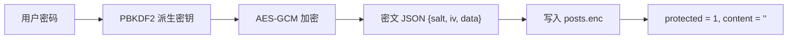

## 当前状态

<Warning>
**本节描述的是接口层面的预留能力，不是当前可用的功能。**

- D1 `posts` 表与 API 保留了 `protected` / `enc` 两个字段，受保护文章的明文 `content` **恒为空**，密文只存在 `enc` 里
- 这样设计的目的：**允许导入外部生成的加密文章**（主仓库 `SECURITY.md` 的原话：「接口预留 `enc` / `protected` 字段，可导入外部加密文章」）
- 后台编辑器**没有**加密 UI——它只提供标题 / 标签 / 封面 / 置顶 / 正文，**没有**「加密」勾选项；分类 / 发布状态也不在编辑器里（分类功能已在 v2.2 移除，`posts.category` 列保留兼容）
- 前端**没有**解密入口：`app.js` 不给带 `enc` 或 `protected` 的文章挂载 AI 摘要入口，也不会提示访客输入密码
</Warning>

## 字段语义

| 字段 | 类型 | 说明 |
|------|------|------|
| `protected` | 0 / 1（SQLite）· boolean（API） | 受保护标记 |
| `enc` | JSON 对象或 `null` | 密文容器，默认形态 `{salt, iv, data}` |
| `content` | 字符串 | 受保护文章的 `content` **恒为空**，避免明文外泄 |

**判定规则**（`api-core.js` 的 `normalizePost` / `postFromRow` 使用同一不变式）：

```
protectedPost = !!p.protected && p.enc && typeof p.enc === 'object'
```

只有 `protected` 为真**且** `enc` 是一个对象时，才被视为受保护文章。任一不满足时 `enc` 归一化为 `null`、按普通文章处理。

## 加密方案（外部生成密文时使用）

| 算法 | 用途 |
|------|------|
| PBKDF2-SHA256 | 从用户密码派生加密密钥 |
| AES-GCM | 对称加密文章正文 |



1. 生成随机盐值（salt）
2. PBKDF2-SHA256 派生密钥
3. 生成随机 IV，AES-GCM 加密正文
4. 写入 `enc` = `JSON({salt, iv, data})`，同时 `protected = 1`、`content = ''`

<Note>
服务端**不做**加解密：它只负责存取密文与保证明文 `content` 不出库。加解密如果要做，只在客户端。
</Note>

## 受保护文章的行为

| 场景 | 行为 |
|------|------|
| `GET /api/posts`（列表） | 返回**已发布**文章摘要：`content` 与 `enc` 一律被剥离；受保护文章不附加 `search` 字段 |
| `GET /api/posts/:id`（详情） | 返回 `protected: true`、`content: ''`、`enc: {salt, iv, data}` |
| RSS（`/feed.xml`） | 受保护文章**自动排除** |
| Sitemap（`/sitemap.xml`） | 受保护文章仍会出现在 URL 列表中（`/posts/<id>/`），但页面内没有正文 |
| 站内搜索 | 非加密文章才带 `search` 字段（正文前 800 字），因此受保护文章的正文**不可搜索** |
| 精选文章 | 不单独过滤受保护文章，但列表接口已剥离 `content` / `enc`，卡片只展示标题与计数值 |
| AI 摘要 | 带 `enc` 或 `protected` 的文章不生成 AI 摘要（卡片与详情页都不挂载摘要入口） |

<Info>
写入路径已保证受保护文章的 `content` 为空；读取路径（`postFromRow`）在出库前**再兜一层**——即使历史数据或手工 SQL 留下了明文，`GET /api/posts/:id` 也不会泄漏出去。
</Info>

## 导入外部加密文章

由于编辑器没有加密 UI，要走加密路径需要直接调 API（需会话 token）：

```bash
curl -X POST https://你的域名/api/posts \
  -H "Authorization: Bearer <session-token>" \
  -H "Content-Type: application/json" \
  -d '{
    "id": "secret-note",
    "title": "加密文章示例",
    "date": "2025-01-01",
    "excerpt": "这是一篇受保护的文章",
    "protected": true,
    "enc": { "salt": "<hex>", "iv": "<base64>", "data": "<base64>" },
    "status": "published"
  }'
```

再次强调：`content` 请留空，明文只应存在于客户端。

## 相关页面

- [安全设计](/security-overview) —— 密码 / 会话 / 登录限流 / 接口安全全貌
- [文章接口](/posts) —— 列表与详情对 `content` / `enc` 的处理
- [数据库结构](/schema) —— `posts` 表字段
