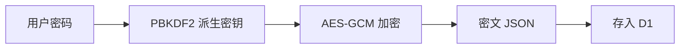

## 加密方案

| 算法 | 用途 |
|------|------|
| PBKDF2-SHA256 | 从用户密码派生加密密钥 |
| AES-GCM | 对称加密文章正文 |

## 加密流程

1. 生成随机盐值（salt）
2. PBKDF2-SHA256 派生 256 位密钥
3. 生成随机 IV，AES-GCM 加密正文
4. 存储 `JSON({salt, iv, data})` 到 `enc` 字段

## 解密流程

1. 获取文章的 `enc` 字段
2. 用户输入密码
3. **前端** PBKDF2 派生密钥 + AES-GCM 解密
4. 显示明文

<Info>
解密完全在前端完成，密码永远不发送到服务端。即使服务端被攻破也无法获得明文。
</Info>

## 安全特性

| 特性 | 说明 |
|------|------|
| 零知识 | 服务端不知道密码 |
| 端到端 | 加密/解密都在浏览器 |
| 强密钥 | PBKDF2 100,000 次迭代 |
| 随机盐值 | 每篇文章独立盐值 |
| 随机 IV | 每次加密新 IV |

## 加密文章的特殊行为

| 场景 | 行为 |
|------|------|
| RSS / Sitemap | 自动排除 |
| 列表展示 | 显示锁定图标，摘要隐藏 |
| 搜索 | 标题/标签可搜索，正文不可搜索 |

## 使用方式

### 加密文章

写作台 → 勾选「加密」→ 输入密码 → 保存

### 阅读加密文章

打开文章 → 输入密码 → 浏览器中解密显示

<Warning>
密码丢失无法恢复。请妥善保管加密密码。
</Warning>
