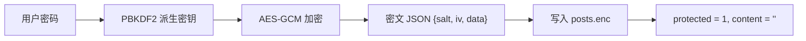

## 当前状态

文章加密已经是**后台可用功能**。编辑器中的「文章加密」开关会将正文在浏览器内加密，服务器只保存密文：

| 字段 | 语义 |
|------|------|
| `protected` | 受保护标记；API 返回 boolean，D1 中为 0 / 1 |
| `enc` | 密文容器 `{salt, iv, data}`；明文文章为 `null` |
| `content` | 受保护文章的正文恒为空字符串，明文不会上传 |

判定规则：只有 `protected` 为真**且** `enc` 是对象时，才被视为受保护文章；否则按普通文章处理。

## 加密方案

| 算法 | 用途 |
|------|------|
| PBKDF2-SHA256 | 从用户密码派生密钥（100,000 次迭代、16 字节随机盐） |
| AES-GCM-256 | 对称加密正文 |

```mermaid
graph LR
    A[用户密码] --> B[PBKDF2 派生密钥]
    B --> C[AES-GCM 加密]
    C --> D["密文 JSON {salt, iv, data}"]
    D --> E[写入 posts.enc]
    E --> F[protected = 1, content = '']
```

服务端**不做**加解密：它只存取密文并保证明文 `content` 不出库。加密与解密都只在浏览器完成。

## 读者体验

1. 文章详情返回 `protected: true`、`content: ''`、`enc: {...}`。
2. 前台渲染锁屏，读者输入密码后在本机解密。
3. 密码错误时拒绝解密；密码不会发送到服务器。
4. 后台编辑器可将密码记在**当前浏览器** `localStorage`，便于日后查看；公共电脑不要使用。

## 受保护文章的行为

| 场景 | 行为 |
|------|------|
| `GET /api/posts` | 列表不返回正文，加密文章不附加搜索片段 |
| `GET /api/posts/:id` | 仅详情返回 `enc`，供前端解密 |
| RSS / Sitemap | RSS 排除加密文章；Sitemap 行为以当前接口为准 |
| 站内搜索 | 加密文章正文不可搜索 |
| AI 摘要 | 加密文章不生成摘要 |
| 备份 / 修订 | 备份保存密文与 `protected` 标记，不保存明文密码 |

## 草稿预览链接

草稿预览使用另一套 HMAC 签名机制，与正文加密相互独立：

- `POST /api/admin/preview-link` 生成链接，默认 7 天、可设 1–30 天
- 链接只对未发布文章有效，凭 token 读取，无需登录
- 未配置 `BLOG_PREVIEW_SECRET` 时，密钥由管理员密码哈希派生；修改密码会让旧链接全部失效
- 预览页 `noindex`、不统计、不加载评论，并返回 `no-store`

详见[预览链接](/preview-links)。

## 相关页面

- [安全设计](/security-overview)
- [文章接口](/posts)
- [数据库结构](/schema)
- [预览链接](/preview-links)
