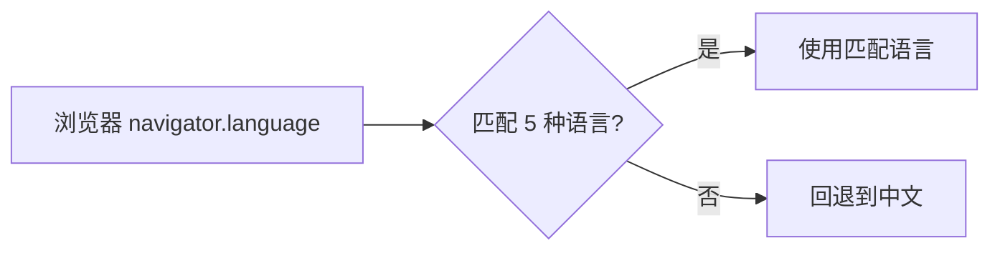

## 支持的语言

| 语言 | 代码 | 文件 |
|------|------|------|
| 中文 | `zh-CN` | `public/locales/zh-CN.json` |
| English | `en` | `public/locales/en.json` |
| 日本語 | `ja` | `public/locales/ja.json` |
| 한국어 | `ko` | `public/locales/ko.json` |
| हिन्दी | `hi` | `public/locales/hi.json` |

## 工作原理



### 中文兜底

中文翻译内嵌在 `i18n.js` 中作为兜底，确保通过 `file://` 本地预览时核心文字始终可读。

## 添加新语言

1. 在 `public/locales/` 下创建新文件（如 `fr.json`）
2. 按现有格式翻译所有 key
3. 在 `i18n.js` 中注册新语言代码

### 语言包格式

```json
{
  "home": "首页",
  "archive": "归档",
  "about": "关于",
  "tags": "标签",
  "admin": "后台",
  "search": "搜索",
  "darkMode": "深色模式",
  "comments": "评论",
  "likes": "点赞",
  "views": "阅读",
  "noPosts": "暂无文章",
  "loading": "加载中..."
}
```

## 翻译贡献

欢迎修正现有翻译或添加新语言支持。翻译文件位于 `public/locales/<lang>.json`。
