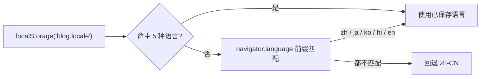

## 支持的语言

界面提供 5 种语言，每种语言的键集完全一致（各 **498** 个键）：

| 语言 | 代码 | 语言包 | 国旗 |
|------|------|--------|------|
| 中文 | `zh-CN` | `public/locales/zh-CN.json` | `public/flags/cn.svg` |
| English | `en` | `public/locales/en.json` | `public/flags/gb.svg` |
| 日本語 | `ja` | `public/locales/ja.json` | `public/flags/jp.svg` |
| 한국어 | `ko` | `public/locales/ko.json` | `public/flags/kr.svg` |
| हिन्दी | `hi` | `public/locales/hi.json` | `public/flags/in.svg` |

语言代码列表定义在 `public/i18n.js` 的 `LANGUAGES` 数组中；模块对外暴露 `window.__i18n`（`t()` / `getLocale()` / `getLanguages()` / `loadLocale()`）。

## 工作原理



- **持久化键**：`blog.locale`（切换语言时写入；只接受受支持的代码）
- **自动识别**：按 `navigator.language` 前缀匹配（`zh` → `zh-CN`）
- **语言包加载**：`public/locales/<lang>.json?v=<I18N_VER>`，`I18N_VER` 是语言包缓存版本
- **HTML lang**：加载完成后同步设置 `document.documentElement.lang`
- **占位符插值**：`t('comment.replyTo', { author: '小明' })` 会替换文案中的 `{author}`

```javascript
// public/i18n.js
var LANGUAGES = [
  { code: 'zh-CN', name: '中文',   flag: '🇨🇳' },
  { code: 'en',    name: 'English', flag: '🇬🇧' },
  { code: 'ja',    name: '日本語',  flag: '🇯🇵' },
  { code: 'ko',    name: '한국어',  flag: '🇰🇷' },
  { code: 'hi',    name: 'हिन्दी',  flag: '🇮🇳' }
];

var DEFAULT_LANG = 'zh-CN';
var I18N_VER = '9';   // 修改 locales/*.json 后递增，强制浏览器拉新文件
```

### 中文兜底

中文翻译**内嵌**在 `i18n.js` 中（`_BUILTIN_ZH`，与 `public/locales/zh-CN.json` 同步）作为兜底：`file://` 本地预览时 fetch 会被浏览器拦截，内嵌副本确保导航、菜单等核心文字始终可读。在线部署时 fetch 成功加载最新 JSON 并覆盖内置值；其它语言加载失败时同样回退到内嵌中文。

<Warning>
`I18N_VER` 是语言包的缓存版本号，参与请求 URL（`?v=9`）。**改完 `public/locales/*.json` 必须手工递增它**，否则浏览器会继续用旧语言包。同时别忘了同步 `i18n.js` 里的内嵌中文兜底。
</Warning>

### 语言包键分组

键名按域前缀分组，便于增量补齐：

| 前缀 | 覆盖范围 |
|------|----------|
| `site.` / `nav.` / `footer.` | 站点标题、主导航、页脚 |
| `theme.` / `bgAnim.` / `i18n.` | 主题色、背景动画、语言标签 |
| `home.` / `archive.` / `tags.` / `about.` / `post.` / `search.` | 前台各页面 |
| `comment.` / `guestbook.` | 评论与留言板 |
| `editor.` / `admin.*` | 后台写作台与各管理模块（含 `admin.breakGlassLink` / `admin.breakGlassKeyLabel` / `admin.breakGlassHint` / `admin.gateThrottled` 等登录限流应急入口文案） |
| `player.` / `music.*` | 音乐播放器与音乐管理 |
| `ai.*` | AI 摘要、写作助手、评论汇总 |
| `toast.` / `loading.` / `mode.` / `confirm.` / `error.` / `export.` | 通用提示 |

## 添加新语言

1. 复制任意语言包为 `public/locales/<lang>.json`，翻译**全部** 498 个键（缺键会回退显示键名或中文兜底）
2. 把新语言加进 `public/i18n.js` 的 `LANGUAGES` 数组，并在 `getLocale()` 的语言前缀匹配里补一条
3. 在 `public/flags/` 下放同名 SVG 国旗（代码 → `cn.svg` / `gb.svg` / `jp.svg` / `kr.svg` / `in.svg` 的命名约定）
4. 递增 `I18N_VER`
5. 运行 `node smoke-test.js` 验证语言包加载与导航渲染

### 语言包格式

```json
{
  "home": "首页",
  "archive": "归档",
  "about": "关于",
  "tags": "标签",
  "admin": "后台",
  "search": "搜索",
  "darkMode": "深色模式",
  "comments": "评论",
  "likes": "点赞",
  "views": "阅读",
  "noPosts": "暂无文章",
  "loading": "加载中..."
}
```

<Info>
上面的片段只演示 JSON 结构（扁平键值对）；真实语言包使用 `nav.home`、`admin.dashboard.totalPosts` 这类带域前缀的键名，可参考 `public/locales/zh-CN.json`。
</Info>

## 界面切换

| 端 | 交互 |
|----|------|
| 桌面 | 顶栏 🌐 图标 → 弹出语言面板（含国旗） |
| 手机 | 侧边栏中的原生下拉选择器 |

切换语言会写入 `blog.locale` 并重新渲染当前路由，无需刷新页面。

## 翻译贡献

欢迎修正现有翻译或添加新语言支持。翻译文件位于 `public/locales/<lang>.json`；改动后记得递增 `I18N_VER` 并同步 `i18n.js` 内嵌中文。流程见[贡献指南](/guide)。
