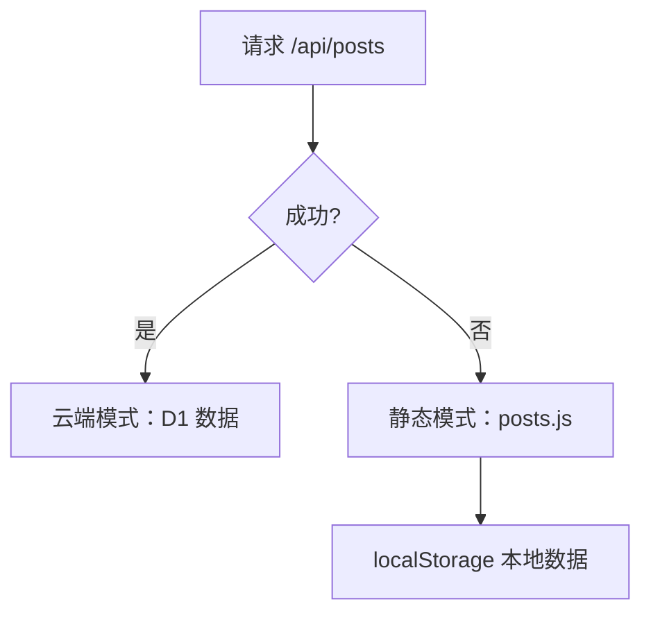

## 双击打开

直接双击 `public/index.html`，浏览器自动加载博客。**零安装、零构建、零依赖**，不需要 Node.js。

<Note>
- **后台管理功能正常**：`/admin` 的登录门禁、写作、导出都在 `file://` 下可用（数据存浏览器 `localStorage`）
- `file://` 协议下**语言包 JSON 可能无法加载**（浏览器对本地文件的 XHR 限制）；`i18n.js` 内置中文兜底，界面核心文字仍可读
- 需要完整体验（语言包、`/feed.xml` 预览等）就用下面的本地服务器

仓库根目录的 `index.html` 只是一张跳转页，会自动打开 `public/index.html`；本地直接双击 `public/index.html` 同样可用。
</Note>

## 本地服务器

```bash
python -m http.server 8080 -d public
# 或
npx serve public
# 或
php -S localhost:8080 -t public
```

打开 `http://localhost:8080/admin`，设置密码即可开始写作。

## 本地调试云端 API（可选）

想在本地跑 Worker + D1 + KV 的完整链路：

```bash
npx wrangler dev -c wrangler.workers.toml
```

<Warning>
`wrangler.workers.toml` 里的 KV `id` / D1 `database_id` 是 `{env.BLOG_KV_ID}` / `{env.BLOG_D1_ID}` **占位符**（wrangler 对 KV 的 `id` 不支持 `{env.}` 内插，CI 部署前才用脚本替换成真实值）。本地直接 `wrangler dev` 会遇到占位符解析问题，两种处理方式：

- **临时替换**：把这两个占位符手动改成真实的 KV id / D1 database_id（注意别把改动提交上去）
- **只调静态页面**：改用 `wrangler dev --local`，接受绑定报错——本地调试前台页面对应的静态资源完全够用
</Warning>

## 数据流



```
文章数据
  ├── 云端模式：GET /api/posts → D1
  └── 静态模式：posts.js → localStorage
```

`config.js` 的 `mode` 决定行为：

| 值 | 行为 |
|----|------|
| `'auto'` | **推荐**。自动检测：`/api/posts` 成功 → 云端；失败 → 静态 |
| `'static'` | 强制静态模式，只用 `posts.js` |
| `'api'` | 强制云端模式，需要后端 API |

<Info>
D1 空表且**尚未配置过管理员**时，云端接口还会回退读取静态 `public/posts.js` 的示例文章（保证首次部署的 RSS / Sitemap 不空白）。一旦配置过管理员（写过 `admin_auth`），就不再回退——否则删光全部文章后示例内容会「复活」进 RSS / Sitemap / 首页。
</Info>

## 导出发布

- **静态模式**：在后台 `/admin` 中一次性导出 `posts.js` / `feed.xml` / `sitemap.xml`，覆盖 `public/` 即可发布（导出入口只在静态模式下出现）。
- **云端模式**：`/feed.xml` 与 `/sitemap.xml` 由 Worker / Pages Functions 实时生成，文章增删改查后自动更新，无需手工维护（因此云端模式没有导出入口）。
- 需要生成 `public/` 下的 `*.min.*` 压缩资源时：

```bash
node scripts/minify.mjs     # 需要 npx terser / clean-css-cli
```

## 相关页面

- [快速开始](/quick-start) —— 两种模式的完整上手流程
- [Cloudflare Workers 部署](/cloudflare-workers) —— 正式发布推荐方式
- [全站配置](/configuration) —— `config.js` 全量键说明
