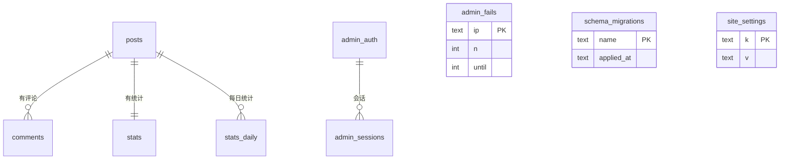

数据库为 Cloudflare D1（SQLite），全部表由 `migrations/` 下的迁移文件创建。下表是当前（迁移编号至 `0015`）的完整结构。

## posts（文章）

```sql
CREATE TABLE IF NOT EXISTS posts (
  id          TEXT PRIMARY KEY,       -- URL 别名
  title       TEXT NOT NULL,          -- 标题
  date        TEXT DEFAULT '',        -- 发布日期
  excerpt     TEXT DEFAULT '',        -- 摘要
  content     TEXT DEFAULT '',        -- Markdown 正文
  cover       TEXT DEFAULT '',        -- 封面图 URL
  pinned      INTEGER DEFAULT 0,      -- 置顶
  protected   INTEGER DEFAULT 0,      -- 加密标记
  enc         TEXT,                   -- 加密数据 JSON，明文文章为 NULL
  tags        TEXT,                   -- 标签 JSON 数组字符串
  category    TEXT DEFAULT '',        -- 分类（产品端已移除分类功能，该列保留兼容）
  status      TEXT DEFAULT 'published', -- published / draft
  created_at  TEXT DEFAULT '',
  updated_at  TEXT DEFAULT ''
);
```

<Info>
`enc` 字段格式：`JSON({salt, iv, data})`，明文文章为 `NULL`；`protected = 1` 时列表接口不下发 `content`。详见[文章加密](/encryption)。
</Info>

## comments（评论）

```sql
CREATE TABLE IF NOT EXISTS comments (
  id        TEXT PRIMARY KEY,
  post_id   TEXT NOT NULL,           -- 所属文章（留言板为合成 ID gb-note / gb-idea）
  author    TEXT DEFAULT '',
  content   TEXT DEFAULT '',
  date      TEXT DEFAULT '',
  status    TEXT DEFAULT 'approved', -- approved / pending
  parent_id TEXT DEFAULT NULL        -- 回复的父评论
);

CREATE INDEX IF NOT EXISTS idx_comments_post        ON comments(post_id);
CREATE INDEX IF NOT EXISTS idx_comments_parent      ON comments(parent_id);
CREATE INDEX IF NOT EXISTS idx_comments_status      ON comments(status);
CREATE INDEX IF NOT EXISTS idx_comments_post_id     ON comments(post_id, id);
CREATE INDEX IF NOT EXISTS idx_comments_status_date ON comments(status, date);
```

<Info>
后两个索引由 `0015_hot_path_indexes.sql` 补齐：`(post_id, id)` 服务文章详情页的评论列表与去重查询，`(status, date)` 服务后台「按审核状态过滤 + 按日期排序」。详见[迁移脚本](/migrations)。
</Info>

## stats（统计）

```sql
CREATE TABLE IF NOT EXISTS stats (
  post_id TEXT PRIMARY KEY,
  likes   INTEGER DEFAULT 0,
  views   INTEGER DEFAULT 0
);
```

## stats_daily（每日统计）

```sql
CREATE TABLE IF NOT EXISTS stats_daily (
  post_id TEXT NOT NULL,
  date    TEXT NOT NULL,       -- YYYY-MM-DD
  views   INTEGER DEFAULT 0,
  likes   INTEGER DEFAULT 0,
  PRIMARY KEY (post_id, date)
);
CREATE INDEX IF NOT EXISTS idx_stats_daily_date ON stats_daily(date);
```

每次阅读/点赞按 `(post_id, date)` 累加，后台「近 30 天趋势」与 `/api/stats/trend` 直接读这张表。

## admin_auth（管理员认证）

```sql
CREATE TABLE IF NOT EXISTS admin_auth (
  k           TEXT PRIMARY KEY,    -- 固定为 'auth'
  salt        TEXT DEFAULT '',
  hash        TEXT DEFAULT '',
  iter        INTEGER DEFAULT 100000,
  must_change INTEGER DEFAULT 0    -- 首次自动初始化的默认密码标记，改密后清零
);
```

<Info>
密码以 PBKDF2-SHA256 加盐哈希存储（`iter` 默认 100000，为 CF WebCrypto 上限），绝不存明文。`must_change` 后端会随登录响应返回，但前端只做提示、不强制跳转。
</Info>

## admin_sessions（登录会话）

```sql
CREATE TABLE IF NOT EXISTS admin_sessions (
  token TEXT PRIMARY KEY,          -- 随机会话 token（hex）
  exp   INTEGER DEFAULT 0          -- 过期时间戳（毫秒），有效期 7 天
);
CREATE INDEX IF NOT EXISTS idx_admin_sessions_exp ON admin_sessions(exp);
```

## admin_fails（登录限流计数）

```sql
CREATE TABLE IF NOT EXISTS admin_fails (
  ip    TEXT PRIMARY KEY,          -- 计数行的键：单 IP / subnet:… / __global__
  n     INTEGER DEFAULT 0,         -- 失败次数
  until INTEGER DEFAULT 0          -- 锁定截止时间；未达阈值时为计数窗口过期时间
);
```

`ip` 列复用为三种计数维度：

| 键形态 | 维度 | 阈值 → 冷却 |
|--------|------|-------------|
| `<真实 IP>` | 单 IP | 5 次失败 → 15 分钟 |
| `subnet:1.2.3.0/24`（IPv4）或 `subnet:2001:db8:0:0:/64`（IPv6 取前 4 段） | 子网 | 15 次失败 → 60 秒 |
| `__global__` | 全局 | 30 次失败 → **仅 10 秒** + 告警日志 |

<Info>
`until` 兼作两种语义：达到阈值时表示**锁定/冷却截止时间**；未达阈值时表示**计数窗口过期时间**（1 小时）。冷却结束后若计数仍达阈值，会在 1 小时老化期内继续保留计数，避免「等冷却归零再重试」。登录与限流细节见[安全概览](/security-overview)与[管理接口](/admin)。
</Info>

## media（媒体）

```sql
CREATE TABLE IF NOT EXISTS media (
  id         TEXT PRIMARY KEY,
  name       TEXT NOT NULL,
  url        TEXT NOT NULL,     -- R2 公开地址或 http(s) 外链
  type       TEXT DEFAULT '',   -- MIME，如 image/png
  size       INTEGER DEFAULT 0, -- 字节
  created_at TEXT DEFAULT ''
);
CREATE INDEX IF NOT EXISTS idx_media_created    ON media(created_at);
CREATE INDEX IF NOT EXISTS idx_media_created_id ON media(created_at, id);
```

图片本体存放在 R2 媒体桶，D1 仅存元数据；接口层只接受 http/https 链接（不接受 base64 内嵌）。详见[媒体](/media)。

## music（音乐）

```sql
CREATE TABLE IF NOT EXISTS music (
  id         TEXT PRIMARY KEY,
  title      TEXT NOT NULL,
  artist     TEXT DEFAULT '',
  url        TEXT NOT NULL,     -- R2 公开地址
  cover      TEXT DEFAULT '',
  size       INTEGER DEFAULT 0, -- 字节
  duration   INTEGER DEFAULT 0, -- 秒
  sort       INTEGER DEFAULT 0, -- 排序
  created_at TEXT DEFAULT ''
);
CREATE INDEX IF NOT EXISTS idx_music_sort ON music(sort, created_at);
```

<Info>
音频文件本体存放在 Cloudflare R2，D1 仅存元数据。详见[音乐](/music)。
</Info>

## site_settings（站点设置）

```sql
CREATE TABLE IF NOT EXISTS site_settings (
  k TEXT PRIMARY KEY,
  v TEXT NOT NULL              -- 字符串或 JSON 字符串
);
```

当前使用六个键：`site_info`、`profile`、`nav_menu`、`footer_nav`、`friend_links`、`moderate_comments`。这些键会覆盖 `config.js` 中的对应项，详见[配置参考](/configuration)与[站点设置](/settings)。

## site_files（站点产物）

```sql
CREATE TABLE IF NOT EXISTS site_files (
  name       TEXT PRIMARY KEY,  -- feed.xml / sitemap.xml
  content    TEXT DEFAULT '',   -- 生成的最新 XML 文本
  updated_at TEXT DEFAULT ''
);
```

## schema_migrations（迁移记账表）

```sql
CREATE TABLE IF NOT EXISTS schema_migrations (
  name       TEXT PRIMARY KEY,                          -- 迁移文件名，如 0015_hot_path_indexes.sql
  applied_at TEXT DEFAULT (datetime('now'))
);
```

<Warning>
这张表**由 CI 创建**（`deploy.yml` 的「Apply D1 schema」步骤里的 `CREATE TABLE IF NOT EXISTS`），**不是** `migrations/` 下的迁移文件。手工执行迁移时若想获得同样的跳过能力，请先自行执行上面的建表语句。
</Warning>

## 索引总览

| 索引 | 表 / 列 | 由哪个迁移创建 |
|------|---------|----------------|
| `idx_comments_post` | `comments(post_id)` | `0001_init.sql` |
| `idx_comments_parent` | `comments(parent_id)` | `0011_comment_reply.sql` |
| `idx_comments_status` | `comments(status)` | `0009_comment_status_index.sql` |
| `idx_stats_daily_date` | `stats_daily(date)` | `0008_stats_daily.sql` |
| `idx_media_created` | `media(created_at)` | `0006_media.sql` |
| `idx_comments_post_id` | `comments(post_id, id)` | `0015_hot_path_indexes.sql` |
| `idx_comments_status_date` | `comments(status, date)` | `0015_hot_path_indexes.sql` |
| `idx_music_sort` | `music(sort, created_at)` | `0015_hot_path_indexes.sql` |
| `idx_media_created_id` | `media(created_at, id)` | `0015_hot_path_indexes.sql` |
| `idx_admin_sessions_exp` | `admin_sessions(exp)` | `0015_hot_path_indexes.sql` |

## ER 关系

