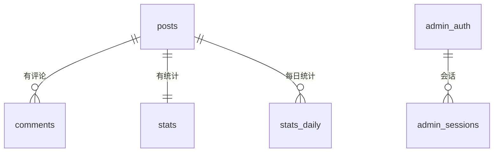

## posts（文章）

```sql
CREATE TABLE posts (
  id          TEXT PRIMARY KEY,       -- URL 别名
  title       TEXT NOT NULL,          -- 标题
  date        TEXT DEFAULT '',        -- 发布日期
  excerpt     TEXT DEFAULT '',        -- 摘要
  content     TEXT DEFAULT '',        -- Markdown 正文
  cover       TEXT DEFAULT '',        -- 封面图 URL
  pinned      INTEGER DEFAULT 0,      -- 置顶
  protected   INTEGER DEFAULT 0,      -- 加密
  enc         TEXT,                   -- 加密数据 JSON
  tags        TEXT,                   -- 标签 JSON 数组
  category    TEXT DEFAULT '',        -- 分类
  status      TEXT DEFAULT 'published', -- 状态
  created_at  TEXT DEFAULT '',
  updated_at  TEXT DEFAULT ''
);
```

<Info>
`enc` 字段格式：`JSON({salt, iv, data})`，明文文章为 `NULL`。
</Info>

## comments（评论）

```sql
CREATE TABLE comments (
  id        TEXT PRIMARY KEY,
  post_id   TEXT NOT NULL,      -- 所属文章
  author    TEXT DEFAULT '',
  content   TEXT DEFAULT '',
  date      TEXT DEFAULT '',
  status    TEXT DEFAULT 'approved', -- approved / pending
  parent_id TEXT DEFAULT NULL   -- 回复的父评论
);
CREATE INDEX idx_comments_post ON comments(post_id);
CREATE INDEX idx_comments_parent ON comments(parent_id);
```

## stats（统计）

```sql
CREATE TABLE stats (
  post_id TEXT PRIMARY KEY,
  likes   INTEGER DEFAULT 0,
  views   INTEGER DEFAULT 0
);
```

## stats_daily（每日统计）

```sql
CREATE TABLE stats_daily (
  post_id TEXT NOT NULL,
  date    TEXT NOT NULL,       -- YYYY-MM-DD
  views   INTEGER DEFAULT 0,
  likes   INTEGER DEFAULT 0,
  PRIMARY KEY (post_id, date)
);
```

## admin_auth（管理员认证）

```sql
CREATE TABLE admin_auth (
  k    TEXT PRIMARY KEY,  -- 固定为 'auth'
  salt TEXT DEFAULT '',
  hash TEXT DEFAULT '',
  iter INTEGER DEFAULT 100000
);
```

## admin_sessions（登录会话）

```sql
CREATE TABLE admin_sessions (
  token TEXT PRIMARY KEY,
  exp   INTEGER DEFAULT 0
);
```

## admin_fails（登录限流）

```sql
CREATE TABLE admin_fails (
  ip    TEXT PRIMARY KEY,
  n     INTEGER DEFAULT 0,   -- 失败次数
  until INTEGER DEFAULT 0    -- 解锁时间
);
```

## media（媒体）

```sql
CREATE TABLE media (
  id         TEXT PRIMARY KEY,
  name       TEXT NOT NULL,
  url        TEXT NOT NULL,     -- data URL 或外链
  type       TEXT DEFAULT '',
  size       INTEGER DEFAULT 0,
  created_at TEXT DEFAULT ''
);
```

## site_settings（站点设置）

```sql
CREATE TABLE site_settings (
  k TEXT PRIMARY KEY,
  v TEXT NOT NULL
);
```

## site_files（站点产物）

```sql
CREATE TABLE site_files (
  name       TEXT PRIMARY KEY,
  content    TEXT DEFAULT '',
  updated_at TEXT DEFAULT ''
);
```

## ER 关系


