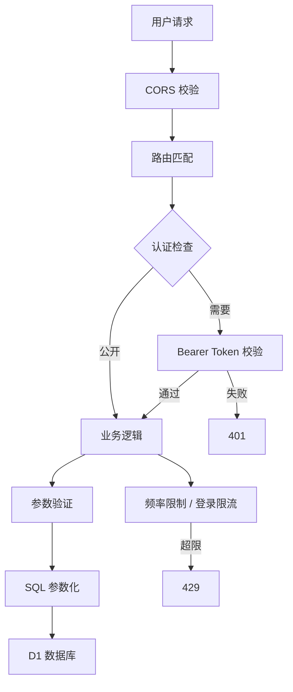

## 安全架构

所有响应（含静态资源）统一附带安全响应头；未知 `/api/*` 一律返回 JSON 404，绝不回退 HTML。

## 密码安全

| 算法 | 说明 |
|------|------|
| PBKDF2-SHA256 | 密码派生函数 |
| 加盐 | 16 字节随机盐（hex），每次生成 |
| 100,000 次迭代 | Cloudflare WebCrypto 的硬上限，也是暴力破解的高成本 |
| 密码长度 | 云端最少 **8 位** |
| 零明文 | 永不存储 / 传输明文 |
| 常量时间比较 | 两侧先做 SHA-256 摘要再异或比较，长度信息不泄露 |

## 会话管理

| 特性 | 说明 |
|------|------|
| Token | 32 字节随机 hex（64 位十六进制） |
| 有效期 | 7 天 |
| 存储 | D1 `admin_sessions` 表（`token` + `exp` 绝对时间戳） |
| 客户端 | 浏览器 `localStorage` |
| 传输 | `Authorization: Bearer <token>` |
| 清理 | 登录成功时顺带清理**过期会话**与已老化的失败计数行 |
| 改密 | 修改密码会清空**所有**会话，强制重新登录 |

## 登录限流

`/api/admin/login` 是全站唯一「凭密码进门」的入口，采用**三层维度 + 短冷却 + 应急通道**：

| 维度 | 阈值 | 冷却 | 说明 |
|------|------|------|------|
| 单 IP | 5 次失败 | 15 分钟 | 只影响攻击者自己的出口 IP |
| 子网（IPv4 /24、IPv6 前 4 段 ≈ /64） | 15 次失败 | 60 秒 | 让「轮换 IP」的成本升到「轮换网段」；冷却刻意很短，避免同网段正常用户被误伤 |
| 全局 | 30 次失败 | **仅 10 秒** + `console.warn` 告警 | 只做短冷却，**绝不做全局长锁定** |

### 为什么不做全局长锁定

把「失败次数」直接做成全局长锁定，等于把可用性交给攻击者：任何人从任意 IP 刷够失败次数，**唯一的管理员就走不了正常登录路径了**（可用性 DoS，只能靠安装密钥的应急通道进门）。而全局长锁定对攻击者几乎没有成本——他换个 IP 就能继续。所以本项目刻意采用「短冷却 + 告警」：10 秒既是阻力，也是对齐 Cloudflare 免费版限流规则最小窗口的取值。

### 计数与老化

| 行为 | 说明 |
|------|------|
| 计数行 | 复用 `admin_fails(ip, n, until)` 表：`until` 既表示锁定截止时间，也表示未达阈值时的计数窗口过期时间 |
| 老化 | 失败计数在最后一次失败后 **1 小时**自动老化清零 |
| 冷却后保留计数 | 已达阈值刚冷却完的一段时间内计数会保留，避免「等冷却归零 → 无限重试」 |
| 锁定期/冷却期 | 命中锁定或冷却时**直接返回 429 早退，不读也不写 D1**——避免被失败登录刷爆免费写额度 |
| 失败不计数 | 应急通道下的失败不计数（防止站长自己把正常路径刷爆） |
| 成功即清零 | 登录成功后清除本机 / 本子网 / 全局三层计数 |

### 应急通道（break-glass）

登录请求携带正确的 `X-Setup-Key`（即 `BLOG_ADMIN_SETUP_KEY`）→ **跳过全部登录限流**，但**不跳过密码校验**。

- 后台登录页在触发限流（返回 429）时会**自动展开**「被限流？用安装密钥登录」入口，并提示「尝试次数过多，已展开「安装密钥」入口」
- 相关 i18n 键：`admin.breakGlassLink` / `admin.breakGlassKeyLabel` / `admin.breakGlassHint` / `admin.gateThrottled`
- 结论：攻击者能造成的最大伤害是让别人 10 秒内登录不了，而**站长永远有一条进得去的路**

### 可选：边缘限流

除了内置三层限流，还可以在边缘再加一道：

| 方案 | 做法 |
|------|------|
| Cloudflare Access | 把 `/admin*` 与 `/api/admin/*` 放到 Zero Trust Access 后面（最推荐） |
| WAF 限流规则 | `URI Path equals /api/admin/login`，10 秒内超过 10 次 → Block 10 秒 |
| Workers 限流绑定 | 配置 GitHub Secret `BLOG_RATE_LIMIT_BINDING` 后重新部署（`env.LOGIN_LIMITER`，10 次/分钟/位置） |

被边缘拦下的请求不进入 Worker，既不消耗 Worker 请求额度，也不碰 D1 / KV 配额。三种方案的逐步操作与取舍见 [Cloudflare Workers 部署](/cloudflare-workers)与 [CLOUDFLARE_SETUP_GUIDE.md 第 9 节](https://github.com/kejiland/qingyu-blog/blob/main/CLOUDFLARE_SETUP_GUIDE.md)。

## 接口安全

| 机制 | 说明 |
|------|------|
| CORS | 配置 `SITE_URL` 后只允许「站点来源 + 请求自身来源」；**未配置时 fail-closed（不返回 `Access-Control-Allow-Origin`）**，跨站读取被浏览器拦下，而不是回显任意来源。响应带 `Vary: Origin` 避免缓存串味 |
| 客户端 IP | 只信任 CDN 注入的 `CF-Connecting-IP`；不读可伪造的 `X-Forwarded-For`（否则可绕过点赞去重 / 评论频控 / 登录锁定等所有按 IP 的限流） |
| 接口边界 | 未知 `/api/*` 一律 **JSON 404**，绝不回退 `index.html`；非 GET / HEAD 请求也不做 SPA 回退（`functions/api/[[path]].js` 是 Pages 侧兜底） |
| 安全响应头 | Worker 对 **API 与静态响应统一注入**：`Content-Security-Policy`（含 `object-src 'none'` / `base-uri 'self'` / `frame-ancestors 'none'` / `form-action 'self'`）、`X-Content-Type-Options: nosniff`、`Referrer-Policy: strict-origin-when-cross-origin`、`X-Frame-Options: SAMEORIGIN`、`Cross-Origin-Opener-Policy: same-origin`；Pages 纯静态路径由 `public/_headers` 提供同一套 |
| XSS 防护 | 用户输入先做控制字符清洗（保留 `\n` `\t`）与 HTML 转义，不执行原始 HTML |
| SQL 注入 | 全部查询参数化（`db.prepare(...).bind(...)`），无字符串拼接 |
| 评论来源校验 | 提交带异源 `Origin` 时拒绝（403） |
| 写操作鉴权 | `Authorization: Bearer <session-token>`；常量时间比较；兼容旧 `BLOG_WRITE_TOKEN` |
| 写接口缓存 | 写操作与评论列表 `Cache-Control: no-store` |
| 错误信息 | 未捕获异常统一返回「服务端内部错误」，SQL / 路径等内部细节只进服务端日志 |
| 密码哈希失败 | `/api/admin/setup` 的 `deriveKey` / D1 写入失败会返回 500 并记录日志，不静默吞掉 |

<Info>
CSP 是**可落地的最小集合**而非最强配置：站点为零构建 + 大量内联脚本 / 样式 + 广告动态注入，无法做强 `script-src`，所以聚焦禁 object / plugin、禁点击劫持、禁 base 标签注入、限制表单提交目标。CSP 括号里的白名单也包含广告与 CDN 来源。
</Info>

## 评论与限流

| 机制 | 值 |
|------|-----|
| 频率限制 | 每 IP **5 条/分钟**（KV `rate:cmt:<ip>:<分钟窗口>`，TTL 120s） |
| 单篇上限 | 300 条 |
| 嵌套深度 | 最多 3 层回复 |
| 重复拦截 | 同分区 + 同昵称 + 同内容 → **409** |
| 昵称 / 正文长度 | 昵称 30 字、正文 1000 字 |
| 点赞去重 | 同 IP 同文章 30 天只计一次；频控 10 次/分钟 |
| 浏览去重 | 同 IP 同文章 1 小时只计一次；频控 30 次/分钟 |
| 审核开关 | `site_settings.moderate_comments`（`'1'` 时新评论进入待审核） |

<Warning>
上述限流与去重都依赖 **KV 绑定**。未绑定 KV 时它们会**静默失效**（服务端日志里会打印一条 warning），并且只有评论数上限 / 嵌套深度 / 重复拦截仍由 D1 保证。
</Warning>

## 文章加密

接口预留 `enc` / `protected` 字段（可导入外部加密文章），后台编辑器**暂未开放**端到端加密 UI。详见 [文章加密](/encryption)。

## 报告漏洞

<Warning>
请勿通过公开 Issue 报告安全漏洞。请通过 GitHub [@kejiland](https://github.com/kejiland) 私信联系维护者，完整策略见 [SECURITY.md](https://github.com/kejiland/qingyu-blog/blob/main/SECURITY.md)。
</Warning>
